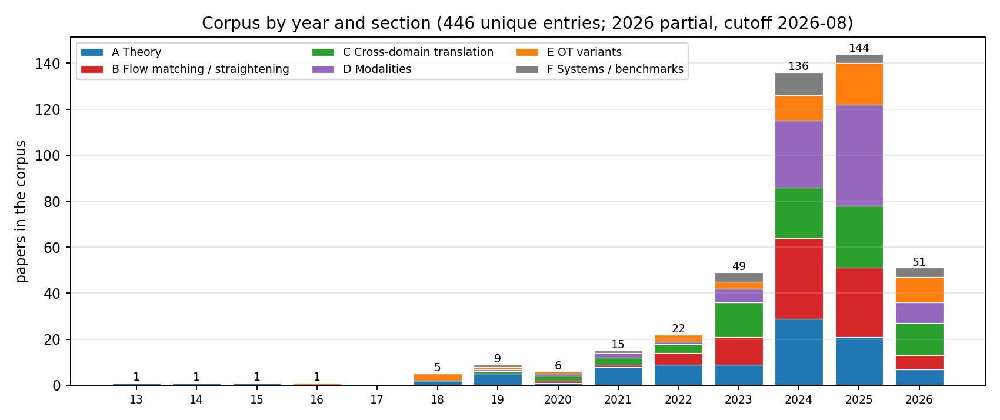
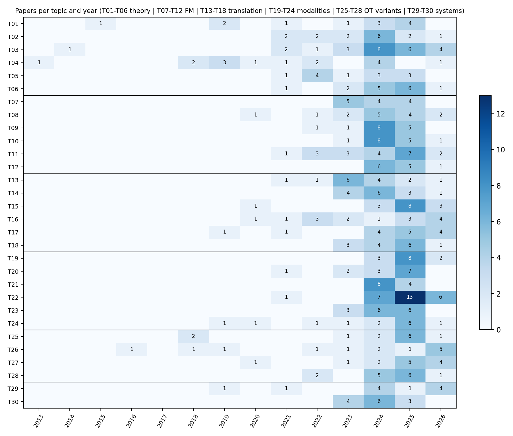
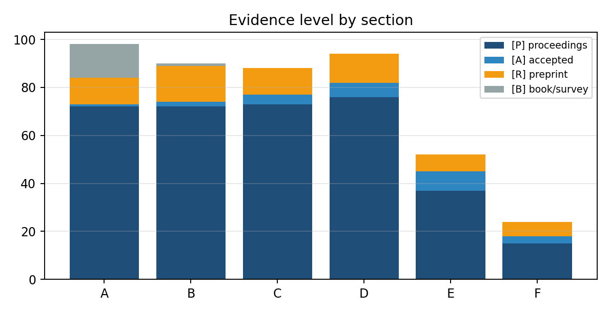

## 0. Guide: One-Sentence Answers to Five Questions

| Question | One-sentence answer |
|---|---|
| **What is the problem** | Generative modeling = transporting a noise/source distribution into a data distribution. The geometry of the transport path (curvature → NFE), the choice of coupling (who is paired with whom), cross-domain semantics (what to preserve and what to change), optimality (is diffusion ≟ OT), and computational and statistical cost constitute five formalizable core problems P1–P5 (§2) |
| **Existing theory** | The skeleton has been closed: diffusion = Wasserstein gradient flow of KL; SB = the dynamic form of entropy-regularized OT (IMF exponential convergence); FM is statistically equivalent to diffusion. Two popular narratives have been falsified by counterexamples—"diffusion encoder ≈ OT" and "straightening = OT"—OT is a design language rather than an automatic property; the August c-RF and reflow×minibatch-OT limit-point theorems provide a repair path of "adding a projection constraint yields OT" (§3) |
| **Classical work** | The mathematical five-piece set (Brenier 1991 / McCann 1997 / JKO 1998 / Benamou–Brenier 2000 / Otto 2001) + the computational three-piece set (Sinkhorn 2013 / Score-SDE 2021 / DSB 2021) + the three paradigm lines (FM / RF / SI, contemporaneous in 2022–23); scale-up completed in 2024 (SD3, Immiscible, AYS, LightSB-M) (§4) |
| **Latest work** | The commanding heights of 2025–26: theoretical closure (IMF exponential rate, FM minimax, O(d/T), c-RF), new one-step generation paradigms (MeanFlow, W-Flow, Beckmann autonomous flow), infrastructure inflection point (FlashSinkhorn = attention isomorphism), bridge models entering medicine and restoration; the three main lines of the 62 new papers in August are "straightening theory plus projection, coupling engineering for cost reduction, and refinement of SB endpoints/reference processes" (§5, `trends/`) |
| **What we can do** | The comparative advantage of universities lies in theory-completion and interface-stitching gaps: training-free batch-level marginal-preserving noise assignment (#1, already initiated and sandbox completed: Hungarian B=128 achieves a gain equivalent to top-1-of-25 with 1 scoring pass per output and zero population marginal drift), OT-aware scheduling (#2), coupling-preserving distillation (#3, deep reading confirms zero guarantees in the bridge distillation literature), medical SB targeting dosimetry (#7, window narrowed) (§8) |

**What to read first**: if pressed for time, read §7 (twelve insights) and §8.1 (Top-10 status table); for theoretical equipment, read §3; for a literature map, read §4–§5 and the 30-topic list in the README; to get hands-on, read §8.2.

**Relation to prior documents**: this report adds three layers on top of the 8/14 survey-closing report and the 8/25 synthesis report—(a) evidence from 446 papers read in depth one by one (`reports/`, every number carries Table/Eq/page); (b) the 2026 Q3 incremental scan (62 papers, `trends/`); (c) the initiation and sandbox results of Top-10 #1 (`~/Code/mpna`). All conclusions that differ from the 8/25 version are marked in the main text.

## 1. Corpus and Method: Where the Evidence in This Report Comes From

### 1.1 Corpus Composition

The corpus comes from 30 parallel literature-survey agents on 2026-08-14 (one subtopic per agent, unified operating specification `source/AGENT_BRIEF.md`), subjected to three-layer ARIS auditing (numerical verification, adversarial review, no-new-blocker adjudication) and an 8/25 trigger-point re-review (SynthRAD2025 official report, FlashSinkhorn version, ECCV/NeurIPS schedules), followed by a Q3 incremental scan on 2026-09-01. Mechanical aggregation yielded 477 citations; after deduplication by title and arXiv id, **446 papers** remain, of which 139 were marked ⭐ core by the survey agents.

| Dimension | Distribution |
|---|---|
| Six sections | A Theory 98 · B Flow Matching/Rectification 90 · C Cross-Domain Translation 88 · D Modalities 94 · E OT Variants 52 · F Systems/Evaluation 24 |
| Evidence level | [P] Formal proceedings 345 · [A] Official acceptance 24 · [R] Preprint 62 · [B] Textbook/Survey 15 |
| Year | Pre-2023: 67 papers (mathematical classics and interface foundations) · 2023: 49 · 2024: 136 · 2025: 144 · 2026: 51 (as of August) |
| Main venues | NeurIPS 96 · ICLR 80 · ICML 71 · CVPR 29 · AISTATS 10 · ECCV 9 · ICCV 9 · AAAI 8 · TMLR 7; arXiv-only 64 |
| arXiv coverage | 345 papers have arXiv ids (including 201 completed via title search); licenses: CC-BY 133, arXiv non-exclusive 169, CC-BY-NC-SA 14, CC-BY-NC-ND 9, CC-BY-SA 6, CC0 2 |
| Primary category | cs.LG 146 · cs.CV 96 · stat.ML 35 · math.OC 16 · math.ST 10 |



The year distribution indicates that this is an interdisciplinary area that only took shape after 2023: 2024–2025 contributed 63% of the literature, with Section B (flow matching/rectification) and Section C (cross-domain translation) expanding in 2024, and Section D (modality extension) following in 2025; output in the theory Section A peaked in 2024 and has held steady since—consistent with the assessment in §3: **the theoretical skeleton has closed, and the increments lie at the seams**.



### 1.2 Method and Discipline of Paper-by-Paper Close Reading

For each paper, a sub-agent produced an 8-section report based on the full PDF text (extracted via PyMuPDF, first 90k characters; longer documents marked "source truncated"): Problem / Method / Theoretical Results / Experiments and Numbers / Position in the OT×Diffusion Map / Limitations and Criticisms / Implications for Us / Resources. Three hard constraints:

1. **Numbers carry provenance**: every numerical value is annotated with Table / Eq. / Sec. / page number; if it cannot be located, write that it cannot be located—do not fill in from memory.
2. **Two layers of limitations**: limitations acknowledged by the authors and limitations identified by the reader are listed separately; the latter must be specific to the experimental setup or theorem assumptions.
3. **Plain language and anti-defensiveness**: each paragraph begins with a claim; rhetorical embellishments are removed but evidence is not (numbers are kept together with the objects they modify); limitations are written only in §6.

Entries without full text receive a "briefing card" (marked at the top with "⚠ Full text not read; based on abstract"), and §3/§4 may only state content present in the abstract. All reports are named by arXiv id (`reports/<id>.md`), with an accompanying machine-readable metadata card (`data/meta/<id>.json`: TL;DR in Chinese and English, key numbers, relation edges).

### 1.3 Translation

Original PDFs are stored under `papers/` named by arXiv id; Chinese translations are produced by the native engine of [SuperTranslate](https://github.com/asimfish/super_translate), which replaces text in place on the original PDF (layout geometry pixel-identical; formulas, tables, and citation markers are placed in protected zones). After translation, object-level QA is run (missed translations, protected-zone alterations, overlaps, missing images) and written to `papers_zh/<id>.inspect.json`. Batch processing prioritizes ⭐ core papers first, with textbooks and long documents over 25MB last (`scripts/translate_batch.sh`). Both translations and originals are distributed as GitHub Release assets; the git repository retains only text, metadata, and QA reports.

### 1.4 Reading Routes

- In a hurry: §0 Five Questions and Answers → §7 Ten Insights → §8.1 Top-10 status table.
- For theoretical equipment: §3 (theorem skeleton and four tensions) → corresponding close reads in `reports/` (every theorem in §3 is tagged with a report id).
- For a literature map: §4 classical chronology → §5 six frontier threads → the 30-topic list in the README.
- To get hands-on: §8.2 MPNA project initiation and sandbox results (reproducible, `~/Code/mpna`).

## 2. What the problems are: five formalizable core questions

### 2.0 The meta-problem

Generative modeling = measure transport: construct a map or process that turns an easy-to-sample \(\mu_0\) (Gaussian noise or source-domain data) into \(\mu_1\) (the data distribution). Diffusion models carry out this transport via an SDE/ODE; optimal transport asks a normative question—is this transport, should it be, and can it be, cost-minimal? The two fields share the same grammar in the Benamou–Brenier dynamic formulation:

\[W_2^2(\mu_0,\mu_1)=\min_{(\rho_t,v_t)}\int_0^1\mathbb E_{\rho_t}\|v_t\|^2\,dt\quad\text{s.t.}\quad\partial_t\rho_t+\nabla\cdot(\rho_t v_t)=0 .\]

The kinetic energy of any generative flow is \(\ge W_2^2\), and the gap is precisely the degree of curvature. This decomposes into five concrete questions.

### P1 Path geometry (why it is slow)

The curvature of PF-ODE sampling trajectories determines discretization error, hence the minimum feasible NFE. Known: trajectories approximately lie in a low-dimensional subspace and exhibit a content-independent "linear–nonlinear–linear" shape (GITS, [`reports/2405.11326.md`](../reports/2405.11326.md): geometric observations in Sec. 3 + scheduling gains at 5–10 NFE); under Gaussian data the reverse SDE/PF-ODE admits analytic solutions and an exact \(W_2\) error decomposition, with the Heun scheme optimal (Pierret–Galerne, [`reports/2405.14250.md`](../reports/2405.14250.md)). New in August: the source of curvature can be attributed to the Jacobian of the denoiser (2609.00198). Unresolved: a first-principles theorem for curvature–optimal scheduling; information-theoretic lower bounds for training-free solvers.

### P2 Coupling choice (who pairs with whom)

Training and inference default to the independent coupling \(q(x_0)q(x_1)\), whose mutually conflicting regression targets cause the velocity field to bend and cross. Known: in-batch OT re-pairing straightens paths and reduces gradient variance (OT-CFM, [`reports/2302.00482.md`](../reports/2302.00482.md)); but minibatch coupling is dominated by the curse of dimensionality, with real gains appearing only for large Sinkhorn with \(n\approx 10^6\) and low entropic regularization (2506.05526); in conditional generation, unconditional OT coupling is harmful (C²OT); semi-discrete coupling bypasses the minibatch issue ([`reports/2509.25519.md`](../reports/2509.25519.md)); August's QC-FM replaces Sinkhorn with an \(O(n)\) quantile coupling (2608.00978). **Core tension**: changing the coupling vs. preserving the marginal—any instance-level selection makes the effective initial distribution deviate from \(\mathcal N(0,I)\). This is the starting point for the MPNA project in §8.2.

### P3 Cross-domain transport (what to preserve, what to change)

In unpaired translation there is no a priori definition of "what should be preserved"; OT provides a canonical answer through the transport cost. Known: SB is the most orthodox framework (DSB → DSBM → UniDB++); neural OT maps translate directly with speed and strong structure but weak texture; "translation = two chained EOT stages" has an explicit proof (DDIB). **New findings from the close reading of T14** ([`reports/2309.16948.md`](../reports/2309.16948.md), `2405.15885.md`, `2410.22637.md`): all paired-bridge models avoid coupling learning—I2SB's SB degenerates under Dirac boundary conditions into per-pair minimum-energy bridges, DDBM's Theorem 2 only guarantees the marginal \(q(x_t\mid x_T)\), and CDBM's Prop. 3.2 only guarantees the PF-ODE solution map; none of them states whether the terminal coupling is preserved after distillation/acceleration. Unresolved: "closer to optimal transport equals better translation" has never been directly answered.

### P4 Optimality (diffusion ≟ OT)

Is the deterministic encoder map defined by the PF-ODE the Brenier optimal map for the quadratic cost? In the Gaussian case it holds exactly (Khrulkov, [`reports/2202.07477.md`](../reports/2202.07477.md)); in general it does not—the flow map is a gradient field at each instant but its composition is generally not the gradient of a convex function, the obstruction being the Hessian non-commutativity term (Lavenant–Santambrogio); at the distribution level, the score-matching loss upper bound controls \(W_2\) (Kwon). Unresolved: a quantitative upper bound on suboptimality (explicitly stated as an open problem by the original authors). The corresponding problem on the rectification side was substantially advanced in August by two works: c-RF (2608.02487) and the limit points of reflow×minibatch-OT (2608.07042)—see §3.3.

### P5 Computation and statistics (how expensive, how accurate)

(a) Scaling OT solvers: FlashSinkhorn rewrites Sinkhorn updates as an attention-isomorphic online-LSE, with \(O(nd)\) memory and up to 161× end-to-end speedup (ICML 2026 Oral, still [A]); (b) the minimax rate for OT map estimation, \(n^{-2\alpha/(2\alpha-2+d)}\), necessarily fails at pixel dimensionality, so low-dimensional/structural assumptions must be introduced explicitly; (c) diffusion iteration complexity is \(O(d/T)\) with adaptive intrinsic dimension \(O(k/T)\); FM is almost minimax, with optimal variance schedule \(\sigma_t\asymp\sqrt t\). Unresolved: statistical rates for OT-coupled training (non-independent coupling) are completely absent; no one has proved a joint "n samples × T steps" lower bound.

## 3. Others' Theory: Theorem Skeletons and Four Major Tensions

### 3.1 Mathematical Equipment Layer (Ready-to-Use Theorems)

| Theorem | Content | Role in Diffusion × OT |
|---|---|---|
| Kantorovich Duality (1942) | Linear programming dual of OT, potentials $f,g$ | Dual potential gradients = natural guidance field |
| Brenier's Theorem (1991, [P]) | For quadratic cost the optimal transport map exists uniquely and $T=\nabla\varphi$, $\varphi$ convex | Foundation of all "encoder ≈ OT map" discussions |
| McCann's Displacement Interpolation (1997) | $W_2$ geodesic $=((1-t)\mathrm{Id}+tT)_\#\mu$ | Canonical definition of "ideal straight trajectory" |
| JKO Scheme (1998, [P]) | Fokker–Planck = $W_2$ gradient flow of KL | Variational structure of diffusion's "dissipation" |
| Benamou–Brenier (2000, [P]) | $W_2^2$ = minimal kinetic energy under continuity equation constraint | Variational structure of diffusion's "geodesy"; ledger of trajectory straightness |
| Semi-discrete OT (KMT 2019, [P]) | Continuous source → discrete target, Laguerre cells, damped Newton with global linear convergence | Matches the engineering reality of "prior → finite dataset"; population limit of MPNA (§8.2) |
| Entropic Regularization / Sinkhorn (2013, [P]) | ε-regularized OT, GPU-parallelizable | Computational substrate for minibatch coupling and SB |

Learning route (conclusion from T01 deep reading): Peyré, *OT for Machine Learners* ([`reports/2505.06589.md`](../reports/2505.06589.md)) read through → Santambrogio 2015 for rigorous proofs → Mérigot–Thibert semi-discrete lecture notes ([`reports/2003.00855.md`](../reports/2003.00855.md)) → Bures–Wasserstein closed forms for Gaussian families as sandbox.

### 3.2 Debate Line One: "Diffusion ≟ OT" (T02)

Pro side: Khrulkov et al. prove that in the multivariate Gaussian case the DDPM encoder is exactly the Monge map and conjecture this holds in general ([`reports/2202.07477.md`](../reports/2202.07477.md)). Con side, settled: Lavenant–Santambrogio three-page counterexample—the PF-ODE velocity field is a gradient field at each instant, but the composed flow map is generally not the gradient of a convex function. Positive patch: under specific conditions on a finite time interval the PF is indeed a Monge map ([`reports/2311.03886.md`](../reports/2311.03886.md)); at the distribution level $W_2\le C\sqrt{\text{score matching loss}}$ ([`reports/2212.06359.md`](../reports/2212.06359.md)); Föllmer/diffusion-type maps possess Lipschitz contraction properties that OT maps have not yet been shown to have. Constructive direction: explicitly constrain the drift back to OT (constrained drift models, Monge–Ampère flows). **Precise picture**: instant-wise optimal ≠ globally optimal; empirically near-optimal; the gap is unquantified.

### 3.3 Debate Line Two: "Straightening ≠ OT" and Its August Repair (T09)

The RF founding work ([`reports/2209.03003.md`](../reports/2209.03003.md)) proves three things: rectification preserves marginals and monotonically non-increases every convex transport cost (Thm 3.3/3.5); straightness $\min_{k\le K}S(Z^k)=O(1/K)$ (Thm 3.7); straight coupling ⇔ interpolation paths do not intersect, which is a necessary but not sufficient condition for c-optimality, coinciding only in 1D (Thm 3.8–3.10). Deep reading also confirms: the $O(1/K)$ bound is over $\min_k$ and assumes exact solution at each step; network approximation error is not in the theorem; the "SOTA" one-step FID 4.85 comparison scope is U-Net one-step models (Table 1(b) itself lists StyleGAN-XL at 1.85).

Counterexample, settled: Hertrich–Chambolle–Delon (NeurIPS 2025) prove that iterative rectification has non-optimal fixed points and that loss tending to zero does not imply optimality. Empirical correction: rfpp achieves near-straightness with a single round of reflow; Rectified Diffusion identifies the essence as "pretrained pairing + retraining."

**Two repair theorems from August**: (i) c-RF (2608.02487): in the Gaussian case ordinary reflow converges to the OT coupling if and only if the source/target covariances commute; after projecting the velocity field onto the gradient class it always converges to the OT coupling, with one-step contraction, exponential rate, and minimax-optimal OT estimation for d≥3. (ii) Reflow × minibatch-OT limit points (2608.07042): the limit of alternating iteration with fixed-batch minibatch OT is an N-cyclically monotone coupling, which converges to the OT map under the gradient-field condition. Both point consistently to: **"straightness" and "optimality" are two degrees of freedom; adding one projection/monotonicity constraint reconnects them**.

### 3.4 Schrödinger Bridge: Five Generations of Solvers and the Refinement of Q3 (T03)

SB: $\min_P KL(P\|Q)$ over path measures s.t. endpoint marginal constraints; static projection = entropic OT; $\varepsilon\to0$ converges to deterministic OT. Five generations of evolution: deep IPF (DSB; SGM is exactly the first IPF iteration) → IMF/bridge matching (DSBM, [`reports/2303.16852.md`](../reports/2303.16852.md): SB is the unique process that is both Markov and in the reciprocal class of the reference bridge) → lightweight (LightSB-M proves SB recovery with a single matching from any coupling) → online/discrete/few-step/semi-supervised (α-DSBM, CSBM, FSBM) → theoretical closure (IMF first non-asymptotic exponential rate; Sinkhorn bridge statistics; IPMF; Tang's 220-page monograph). New phase of Q3 (§5): how to choose the reference process (PRISM), how to relax endpoint constraints (SDDBMs), continuity bounds for mixture-distribution bridges (2608.13383), denoising diffusion = high-temperature SB (2608.25094).

### 3.5 Gradient Flow and Wasserstein Proximal (T05)

Neuralized JKO: ICNN convex potential → block-wise CNF → S-JKO exploits the JKO↔UOT equivalence to reduce complexity O(K²)→O(K). SGM = Wasserstein proximal operator (`2503.01998` (deep read; see corresponding README entry) line): the score model implicitly implements the regularized WPO of cross-entropy; MFG optimality conditions = forward controlled FP + backward HJB; kernel formula explains memorization. Inverse-problem line: JKOnet*; W-Flow distills the entire Sinkhorn-WGF evolution into a one-step generator (1-NFE FID 1.29, [R]). Q3: WGF becomes a fine-tuning tool—reward-guided one-step models (2608.29647), CVaR extreme events (2608.11544).

### 3.6 Convergence and Statistical Theory: The Reviewer's Yardstick (T06)

| Problem | Current best result | Source |
|---|---|---|
| Sampling iteration complexity (given score) | TV: O(d/T), requires only first moment + L² score; KL: Õ(d/ε) | Li–Yan JMLR 2025 [P]; 2508.16306 [R] |
| Intrinsic dimension adaptation | KL steps linear in k and sharp for manifold data; DDPM automatically near k-linear | Potaptchik COLT 2025; Huang–Wei–Chen MOR 2026 |
| End-to-end statistics | Diffusion is a near-minimax distribution estimator over Besov classes; score estimation rate $\tilde\Theta(n^{-2/(d+4)})$ | Oko ICML 2023; Wibisono COLT 2024 |
| FM theory | Almost minimax (1≤p≤2); $\sigma_t\asymp\sqrt t$ optimal; $W_2$ error bounds | Fukumizu ICLR 2025; Benton TMLR 2024 |
| PF-ODE (deterministic) | TV rate O(k/T) adaptive to intrinsic dimension; end-to-end near-minimax requires simultaneous Jacobian error control | Tang–Yan 2025; 2503.09583 [R] |
| OT map estimation | Minimax rate $n^{-2\alpha/(2\alpha-2+d)}$; plug-in optimal with CLT; neural maps cover general function spaces | Hütter–Rigollet; Manole; Divol (all AoS) |
| Entropic regularization side | Entropic map estimator balances rate and scalability; rate depends only on the "simple" side | Pooladian–Niles-Weed; Groppe–Hundrieser JMLR 2024 |
| Function-space FM (new in Q3) | Strong L² convergence of velocity objective under finite-coefficient/point-value discretization + end-to-end Wasserstein bound | 2608.04531 [R] |

Key gap (= our opportunity): existing FM statistical theory covers only independent couplings—the end-to-end convergence rate of OT-CFM is the natural intersection theorem of diffusion × OT (§8.1 #5).

### 3.7 Stochastic Optimal Control as a Unifying Lens (T02)

Hopf–Cole/HJB interprets the ELBO as a verification theorem ([`reports/2211.01364.md`](../reports/2211.01364.md)); SOC solution reduces to regression (SOCM); reward fine-tuning = memoryless SOC, requiring $\sigma(t)=\sqrt{2\eta_t}$ to eliminate initial-value bias (Adjoint Matching). Implication for us: replacing the terminal reward with a transport cost functional yields the principled mechanism for "steering a pretrained diffusion to a target coupling."

### 3.8 Four Major Theoretical Tensions (the analytical spine of this report)

1. **Dissipation vs geodesy**: on the same $\mathcal P_2$ manifold, diffusion follows the KL gradient flow (JKO), OT follows geodesics (BB)—all entanglements stem from the non-coincidence of these two variational structures.
2. **Instant-wise optimal vs globally optimal**: the PF-ODE is a gradient field at every instant, but the composition is not (the essence of the Lavenant counterexample).
3. **Straight vs optimal**: straightening reduces cost but fixed points need not be optimal (Hertrich); c-RF projection and the N-cyclic monotonicity condition repair optimality (August).
4. **Acceleration vs statistical accuracy**: iteration complexity and statistical rates are each sharp, but the joint frontier is uncharacterized by anyone.

A fifth engineering tension added by deep reading (from T14/T12): **changing the coupling vs preserving marginals**—instance-level noise/endpoint selection improves compatibility but alters the effective initial distribution; the literature almost never reports marginal drift. This is the motivating problem for §8.2.

## 4. Canonical Works: A Foundational Timeline (The Canon)

### 4.1 Mathematical Classics (1781–2014)

| Year | Work | Why It Is Canonical |
|---|---|---|
| 1781 | Monge, *Mémoire sur la théorie des déblais et des remblais* | Original mapping formulation; nonconvex and potentially infeasible |
| 1942 | Kantorovich relaxation | LP over couplings + duality; OT becomes an analyzable object |
| 1991 | **Brenier polar factorization theorem** (CPAM, [P]) | Quadratic-cost optimal map = gradient of a convex potential; welds OT to Monge–Ampère and convex analysis |
| 1997 | McCann displacement interpolation | $W_2$ geodesics: the standard language of distribution deformation |
| 1998 | **JKO scheme** (SIAM JMA, [P]) | Fokker–Planck = Wasserstein gradient flow of KL |
| 2000 | **Benamou–Brenier** (Numer. Math., [P]) | $W_2^2$ = minimal kinetic energy; the universal syntax for PF-ODE/FM analysis |
| 2001 | Otto calculus | Riemannian geometrization of $\mathcal P_2$ |
| 2013 | **Cuturi Sinkhorn** (NeurIPS, [P], [`reports/1306.0895.md`](../reports/1306.0895.md)) | Entropic regularization brings OT into the GPU era |
| 2014 | Léonard SB survey ([B]) | Modern treatment of Schrödinger's 1932 problem: path-entropy minimization ⇔ EOT |

### 4.2 Canonical Interfaces to Generative Modeling (2021–2023)

| Year · Venue | Work | Foundational Contribution | Deep Read |
|---|---|---|---|
| 2021 · ICLR Oral | Score-SDE | VP/VE-SDE + PF-ODE unified framework; defines the "encoder map" | `2011.13456` (see corresponding README entry for deep read) |
| 2021 · ICLR | DDIM | Deterministic sampling = first-order exponential discretization of the PF-ODE | [`reports/2010.02502.md`](../reports/2010.02502.md) |
| 2021 · NeurIPS Spotlight | **DSB** | SB enters generative modeling: SGM = first IPF iteration | `2106.01357` (see corresponding README entry for deep read) |
| 2021 · NeurIPS | W2 benchmark | First ground-truth evaluation of neural OT solvers: "good downstream ≠ accurate map" | [`reports/2106.01954.md`](../reports/2106.01954.md) |
| 2022 · NeurIPS | EDM | Unified training/sampling design space; common few-NFE benchmark | [`reports/2206.00364.md`](../reports/2206.00364.md) |
| 2022 · NeurIPS | DPM-Solver | Semilinear structure with tailored exponential integrators; NFE from hundreds to 10–20 | [`reports/2206.00927.md`](../reports/2206.00927.md) |
| 2023 · ICLR | **Flow Matching** | Conditional paths + CFM objective: simulation-free training of CNFs | [`reports/2210.02747.md`](../reports/2210.02747.md) |
| 2023 · ICLR | **Rectified Flow** | Linear interpolation + reflow: the "straight lines buy compute" program | [`reports/2209.03003.md`](../reports/2209.03003.md) |
| 2023 · ICLR / JMLR 2025 | Stochastic Interpolants | Arbitrary two-distribution interpolation unifying flows/diffusions/SB | [`reports/2303.08797.md`](../reports/2303.08797.md) |
| 2023 · ICLR | **Khrulkov conjecture** + Lavenant counterexample | Settles "diffusion ≟ OT": true for Gaussians, false in general, quantitative question open | [`reports/2202.07477.md`](../reports/2202.07477.md) |
| 2023 · ICLR | **DDIB** / NOT | Translation = concatenation of two EOTs; weak OT unifies saddle-point solvers | [`reports/2203.08382.md`](../reports/2203.08382.md) |
| 2023 · ICML | **I2SB** | SB becomes tractable given boundary pairs; first proof of industrial viability for bridge models | [`reports/2302.05872.md`](../reports/2302.05872.md) |
| 2023 · ICML / TMLR 2024 | Multisample FM + OT-CFM | Batch-level OT coupling enters FM training: straightening + variance reduction | [`reports/2302.00482.md`](../reports/2302.00482.md) |
| 2023 · NeurIPS | **DSBM/IMF** | Markov × reciprocal double projection: SB solving without accumulated error | [`reports/2303.16852.md`](../reports/2303.16852.md) |
| 2023 · NeurIPS | UOTM | UOT semidual generative model: outlier robustness | [`reports/2305.14777.md`](../reports/2305.14777.md) |

### 4.3 Scaling and Industrialization (2024)

SD3's large-scale ablations establish the RF formulation + logit-normal time sampling as the industrial standard (ICML 2024 Oral); SiT completes a four-axis interpolant ablation on the DiT backbone (ECCV 2024); DDBM unifies the bridge design space ([`reports/2309.16948.md`](../reports/2309.16948.md): Theorem 2 guarantees only marginals, see §2 P3); Immiscible Diffusion proves that data-pipeline-level noise assignment accelerates training by up to 3× with a one-line change ([`reports/2406.12303.md`](../reports/2406.12303.md)); AYS/GITS turn sampling schedules into a principled problem; LightSB-M/α-DSBM/ASBM make SB lightweight and online; UOT-FM proves that an unbalanced map = a balanced map with rescaled marginals; moscot pushes OT to 1.7 million cells (T24).

## 5. Latest Work: 2025–2026 Frontier Map (with Q3 Increments)

### 5.1 Theoretical Closure Line

| Work | Venue · Tier | One-liner |
|---|---|---|
| IMF exponential convergence rate | NeurIPS 2025 [P] | First non-asymptotic KL exponential rate for SB solver iterations |
| "reflow≠OT" counterexample | Hertrich et al. NeurIPS 2025 [P] | Non-optimal fixed points exist; loss tending to zero ≠ optimality |
| **c-RF computational-statistical guarantees** | 2608.02487 [R] | In the Gaussian case, reflow→OT iff covariances commute; c-RF always converges + exponential rate + minimax-optimal OT estimation |
| **reflow×minibatch-OT limit points** | 2608.07042 [R] (Q3 new) | Limit = N-cyclically monotone coupling; converges to OT map under gradient-field conditions |
| FM almost minimax | Fukumizu ICLR 2025 [P] | Statistically FM is equivalent to diffusion; $\sigma_t\asymp\sqrt t$ is optimal |
| O(d/T) / O(k/T) | Li–Yan JMLR 2025; MOR 2026 [P] | Linear dimension dependence, adaptive to intrinsic dimension |
| SGM = Wasserstein proximal | SIMODS 2026 [P] | MFG (FP+HJB) characterizes score models |
| Sinkhorn bridge statistics | 2510.22560 [R] | Unified generalization analysis for matching-based estimators |
| Entropy-Controlled FM | 2602.22265 [R] | Entropy-rate-budgeted FM = SB with explicit entropy multiplier; Γ-converges to OT |
| **PRISM / SDDBMs / mixture-distribution bridges** | 2608.06893 / 2608.08594 / 2608.13383 [R] (Q3 new) | Reference-process design for SB, endpoint relaxation, Wasserstein continuity bounds for Gaussian mixture bridges |
| **Lagrangian-view FM** | 2609.00198 [R] (Q3 new) | Denoiser Jacobian is the dominant source of trajectory curvature |
| Conditional W-distance geometry | JMLR 2025 [P] (T18) | Joint $W_2$ does not control posterior $W_2$ |

### 5.2 One-Step Generation New Paradigm Line

MeanFlow (NeurIPS 2025 Oral, ImageNet-256 1-NFE FID 3.43) → W-Flow (Sinkhorn-WGF distillation, 1-NFE FID 1.29, [R]) → **Beckmann Transport Models** (2608.01692, autonomous velocity field exactly maps two distributions, unifying Poisson Flow and Equilibrium Matching) → PMOT (2608.05666, scalar-potential parameterization of generalized BB); Flow Map Matching / Transition Matching shift the learning object from instantaneous velocity to two-time flow maps; LBM (ICCV 2025 Highlight, [`reports/2503.07535.md`](../reports/2503.07535.md)) distills bridges to 1 NFE; CAF/HRF abandon the constant-velocity assumption. Q3: MeanFlow enters SE(3) grasping and Lie-group constraints (2608.03295, 2608.26076); the mean-velocity paradigm becomes the default few-step scheme.

### 5.3 Coupling Engineering Line (Training Side)

Large-scale Sinkhorn coupling (2506.05526, Apple: real gains only at n≈10⁶) → semi-discrete coupling ([`reports/2509.25519.md`](../reports/2509.25519.md): precompute dual potentials on the full dataset, table-lookup pairing at training time) → LOOM-CFM (cross-batch exchange of locally optimal pairings) → C²OT (unconditional OT coupling is harmful in conditional generation) → expected batch plan theory (2605.12174) → Designing OT Flows (make the identity coupling itself optimal) → **Q3: QC-FM one-sided quantile coupling O(n)** (2608.00978), **Gromov-Monge FM equivariant coupling** (2608.26961). Trend: from "computing larger OT" to "computing smarter structured approximations."

### 5.4 Inference-Time Alignment Line (Training-Free Side, T12 Seven Stages)

① Data-pipeline noise assignment (Immiscible) → ② Initial-value retrieval/search (NoiseQuery [`reports/2412.05101.md`](../reports/2412.05101.md); verifier×search `2501.09732` (see corresponding README entry for deep read)) → ③ Initial-value continuous transformation (Golden Noise [`reports/2411.09502.md`](../reports/2411.09502.md); NoiseRefine) → ④ OT-bridged prior (semi-discrete one-step bridge + short-range diffusion) → ⑤ Mid-trajectory alignment (nearly empty) → ⑥ Cross-frame noise transport (∫-noise; Go-with-the-Flow) → ⑦ inversion-side coupling. **Deep-read finding**: papers on this line universally report quality/alignment metrics but **do not report drift or diversity loss of the noise population marginal** (T12 deep read §6 consistently notes this); Oracle Noise (2604.23540) points out that Euclidean-gradient noise optimization pushes away from the Gaussian typical set. §8.2's MPNA targets exactly this gap.

### 5.5 Bridge and Translation Line

UniDB++ (TPAMI 2026, closed-form reverse solution for SOC unified bridge + SDE-Corrector); DBIM / CDBM (DDIM / consistency distillation of bridges); FSBM (<8% paired samples semi-supervised SB); CSBM / 3MSBM / Reflected SBM (discrete, multi-marginal momentum, bounded domains); DIOTM / OTP / ENOT (stabilization of the static-map line); LSB (training-free SB approximation with pretrained SD); Bridge vs FM unified comparison (FM is a degenerate special case of DB). **Q3 adds 11 papers** (`trends/`): breast DCE-MRI latent bridge, MRI super-resolution bridge at 10 steps, DoseBridge proton dose prediction (directly targeting dose), EditBridge 4K, ReBridge-Flow posterior bridge recoupling, Di²CycleSB, discrete diffusion bridge DDB (ECCV 2026), BIT text–image bidirectional bridge, UniCycleFlow. T14 deep-read empirical regularity: **the optimal noise level for stochastic bridge vs deterministic straight line is determined by task conditional entropy and step budget** (consistent across I2SB Table 6/9, DDBM Sec. 5, DBIM Table 4/5, LBM ablations).

### 5.6 Systems and Evaluation Line

FlashSinkhorn (ICML 2026 Oral, [A]: Sinkhorn = attention normalization, forward 9–32×, end-to-end 161×; no release after v0.3.3, multi-GPU / non-Euclidean cost gaps remain); low-rank/hierarchical line FRLC → HiRef → HALO; on-device SnapGen / SVDQuant; evaluation: FID is distorted for few-step models; SynthRAD2025 officially confirms only moderate correlation between image similarity and dose accuracy. Q3: distillation written as a Sinkhorn divergence objective (2608.15215), FGW as structural evaluation (2608.28733) — the periphery of OT-based evaluation is beginning to be filled in.

### 5.7 Top-Venue Trends

FM mention-level acceptance volume has grown roughly 3× for two consecutive years (ICLR 7→46→144; ICML 13→56→167; NeurIPS 6→32→88); OT is steadily rising (ICML 2026 doubled 43→114). Schedule: ECCV 2026 9/8–12 (proceedings LNCS 17001–17083 already online); NeurIPS 2026 decisions 9/24; ICML 2026 PMLR volume not yet out. Window-period judgment unchanged: theoretical gap roughly 12–18 months, application verticals longer, but the #7 medical-bridge window is narrowing (DoseBridge already targets dose directly).


## 6. Cross-Paper Findings from Close Reading by Section

This section is synthesized from close reading of 30 topics (`topics/tNN.md`): each observation cites at least two close-reading reports as evidence.

### 6.1 Block A: Theoretical Foundations

**T01 Mathematical Foundations of OT (A Minimal Necessary Set for Generative Model Researchers)** — This topic addresses the problem of identifying the minimal necessary set of OT mathematical foundations for generative model researchers: which theorems (Brenier, Kantorovich duality, Benamou–Brenier dynamic formulation, semi-discrete OT) are indispensable for understanding the relationship between diffusion/flow models and OT, and in what order they should be read. The methodological lineage exhibits a clear textbook evolution: Villani (theoretical encyclopedia) → Santambrogio (applied mathematics) → Peyré–Cuturi (computational) → Figalli–Glaudo/ABS (course-oriented) → Chewi et al. (statistical) → Peyré 2025 (ML-oriented rewriting). The current consensus is: the Brenier theorem (characterization via gradients of convex potentials) is the theoretical foundation for the proposition that "diffusion latent codes ≈ OT maps"; the Benamou–Brenier kinetic energy formulation is the unified syntax for trajectory straightness analysis; semi-discrete OT corresponds exactly to the generative modeling setting of "continuous prior → finite samples." The disagreement lies in: the tension between the stability of exact OT maps on empirical distributions (the n^{-1/d} curse of dimensionality in 2505.06589 Remark 2.32 versus 2407.18163 Prop. 2.1) and minibatch/entropic approximations (T04/T08), as well as the fact that semi-discrete OT, due to its dependence on computational geometry for Laguerre tessellations, is practically limited to low dimensions (d≤3), forcing the generative modeling literature to turn to approximate methods.

- The two proof routes for the Brenier theorem (cyclic monotonicity → Rockafellar → convex potential versus dual potential → c-concavity → Fenchel) are complementary across textbooks, and reading both covers all standard proof approaches. 2407.18163 Chapter 1 follows the "cyclic monotonicity → Rockafellar → convex potential" route (Thm 1.14 gives the tripartite equivalence: optimal coupling ⇔ convex gradient map ⇔ strong duality), while 2505.06589 and 1803.00567 follow the "dual potential → c-concavity → Fenchel" route (1803.00567 Thm 2.1 gives T = grad of convex phi = |x|^2/2 - f). The two routes are developed separately in 2505.06589 §2.4 and 2407.18163 §1.5.3, with no overlap. (Evidence: 2407.18163, 2505.06589, 1803.00567)
- Semi-discrete OT is the precise mathematical tool for the "continuous prior → finite samples" setting, but its computational feasibility is strictly limited by dimension. The damped Newton method of 1603.05579 (Thm 1.5: global linear + local 1+alpha convergence) provides convergence guarantees for semi-discrete OT, but 2003.00855 points out that Laguerre tessellations depend on computational geometry and are practically limited to d=3; 2505.06589 Remark 2.33 explicitly states that numerical methods for the Monge–Ampère equation are not described. This explains why the generative modeling literature has turned to minibatch/entropic approximations (T04/T08). (Evidence: 1603.05579, 2003.00855, 2505.06589)
- The Benamou–Brenier dynamic formulation is the unified syntax connecting OT theory with probability-flow ODEs / flow matching, but coverage depth varies significantly across textbooks. A_computational_fluid_mechanics_solution_to_the_Mo is the original source of the W_2 dynamic formulation, recasting OT as minimal kinetic energy subject to a continuity equation constraint; 1803.00567 Chapter 7 provides its numerical entry point (staggered grid + proximal solver); but 2407.18163 contains no standalone statement of the Benamou–Brenier theorem in the entire book, with the dynamic formulation appearing only through Otto geometry (§5.1–5.4), indicating that statistics-oriented textbooks exhibit selective omission of the dynamic formulation. (Evidence: A_computational_fluid_mechanics_solution_to_the_Mo, 1803.00567, 2407.18163)
- The "ML-ification" of OT textbooks reaches its apex in 2025, but the new textbook's volume and positioning contain an internal contradiction. 2505.06589, at 480 pages and 16 chapters, calls itself a "condensed version," yet v3 remains an arXiv preprint without peer review, with chapter numbering varying across versions; 1803.00567 covers the computational mainline in 209 pages but stops at algorithmic coverage as of 2019; 2512.06797, as a 25-page sketch, discusses only structure and no algorithms. The three form a "textbook—computation—structure" stratification, but the tension between 2505.06589's volume and its "minimal necessary set" positioning remains unresolved. (Evidence: 2505.06589, 1803.00567, 2512.06797)

**T02 Theoretical Connections between Diffusion Models and OT** — The core problem addressed by this topic is: what exactly is the relationship between diffusion models (particularly the encoder/flow map of the PF-ODE) and optimal transport (OT). The methodological lineage shows a clear progression: from Song et al. defining the PF-ODE as providing a mapping object, to Khrulkov et al. proposing the "encoder = Monge map" conjecture and proving it in the Gaussian case, to Tanana and Lavenant–Santambrogio refuting the general case via counterexamples (the obstacle being Hessian non-commutativity), followed by Pierret–Galerne providing exact solutions for arbitrary finite intervals in the Gaussian case, P. Zhang et al. providing positive finite-interval results on collinear data, and Dumont–Lacombe–Vialard responding constructively to the counterexamples via constrained gradient flows. The current consensus is: pointwise infinitesimal optimality (gradient fields) does not imply global optimality (gradients of convex functions), but the numerical gap is often small; the disagreement lies in the quantitative degree of "near-OT" behavior and the conditions under which the finite-interval PF is exactly the Monge map. Meanwhile, distribution-level W2 upper bounds (Kwon–Fan–Lee) and variational-level SOC/HJB formulations (Berner et al., SOCM, Adjoint Matching, WPO) provide theoretical tools for training and fine-tuning under OT metrics that are independent of the map-level debate.

- The debate over "whether the PF-ODE encoder is an OT map" has completed a full cycle of conjecture—counterexample—boundary characterization, with the core obstacle precisely identified as non-commutativity of the Hessian family. Khrulkov et al. proved in the Gaussian case that the encoder equals the Monge map (Theorem 3.1), but Lavenant–Santambrogio proved that in the general case the non-commutativity of D²u and D²(log det D²u − |∇u|²/2) (Eq. 9) pushes the composite flow map outside the class of gradients of convex functions; Tanana's DS∞ asymmetry test (numerical counterexample 0.441 vs 0.467) is an earlier precursor, and P. Zhang et al.'s positive result on collinear data (Prop. 2/4) shows that commutativity holds automatically in degenerate cases. (Evidence: 2202.07477, The_flow_map_of_the_Fokker_Planck_equation_does_no, 1709.06464, 2311.03886)
- The Gaussian case is the only fully analytically resolved positive boundary, but "PF-ODE = OT map under Gaussianity" relies on the strong condition of covariance commutativity, which masks the non-commutativity obstacle. Pierret–Galerne's Prop. 3 provides a closed-form solution for the Gaussian PF-ODE on arbitrary finite intervals [0,t] and confirms it is an OT map, but this conclusion relies on Σt being a function of Σ; Tanana's counterexample (A=diag(4,1), B=[[2,1],[1,3]]) demonstrates precisely that when A and B are non-commutative, the Jacobian of the heat flow map is asymmetric, so the Gaussian positive result cannot be extrapolated. (Evidence: 2405.14250, 2202.07477, 1709.06464)
- Distribution-level W2 guarantees and map-level OT properties are two independent theoretical lines: the score matching loss controls the W2 distance but does not require the encoder to be an OT map. Kwon–Fan–Lee prove W2(p0,q0) ≤ C√J_SM + I(T)W2(pT,qT) (Corollary 1), where I(T) depends on the one-sided Lipschitz constant and may grow exponentially; Pierret–Galerne's exact Gaussian W2 values (Heun 0.18 vs EM 0.40, NFE=500) provide a testbed for checking the tightness of this upper bound; Mikulincer–Shenfeld's Brownian transport map contraction theory (Theorem 3.1) provides a dimension-independent contraction constant for stochastic transport maps from the probabilistic side. (Evidence: 2212.06359, 2405.14250, 2111.11521)
- Variational-level SOC/HJB formulations unify diffusion training objectives as path-space KL minimization, sharing the kinetic energy term with OT's Benamou–Brenier geodesic structure but differing in the entropy term. Berner et al. prove that ELBO/DSM is a special case of the control-theoretic verification theorem (running cost ½∫‖u‖² + terminal cost); B. Zhang et al. further characterize SGM as a Wasserstein proximal operator of cross-entropy (step size h=β²T), juxtaposed with OT-flow as the WPO of KL; SOCM and Adjoint Matching recast the same SOC problem as least-squares regression, with the latter using a memoryless noise schedule σ(t)=√(2ηt) to eliminate initial-value bias. (Evidence: 2211.01364, 2402.06162, 2312.02027, 2409.08861)

**T03 Schrödinger Bridge and Diffusion Generative Modeling** — The core problem addressed by T03 is how to solve the Schrödinger Bridge (SB) efficiently and scalably, and to use it for generative modeling and trajectory inference. The methodological lineage begins with first-generation deep IPF (DSB, SB-FBSDE), whose pain points (error accumulation, trajectory caching, forgetting the prior) gave rise to second-generation IMF/bridge matching (IDBM, DSBM), which maintains both endpoint marginals via alternating Markov/reciprocal projections. The third generation (LightSB-M, [SF]²M, VSDM) targets simulation-free or lightweight parameterization, with LightSB-M proving that a single optimal projection of any coupling yields the SB. The fourth generation (α-DSBM, ASBM, BM²) makes IMF continuous or discrete, enabling online single-network updates and few-step generation. The fifth generation (2510.20871, 2510.22560, IPMF) supplies non-asymptotic convergence rates and statistical theory, and unifies [SF]²M/LightSB(-M)/DSBM-IMF/BM² as different optimization paths for the same estimator. The current consensus is: under the Wiener reference and exact optimization, the target estimators of multiple methods coincide; the disagreement lies in iterative versus single-loop approaches, parametric expressiveness versus simulation-free operation, and whether theoretical guarantees cover neural regression approximation error.

- IMF-family methods (IDBM/DSBM/α-DSBM/BM²) share the same theoretical core, but convergence guarantees long remained at the asymptotic level, with non-asymptotic rates only supplied by the fifth generation. DSBM's Theorem 8 only gives convergence in the KL sense without a rate; BM²'s Theorem 2 is explicitly not a convergence theorem; 2510.20871 provides the first non-asymptotic exponential convergence rate for IMF, covering log-concave and weakly log-concave marginals, but requires the Markov projection to be executed exactly. (Evidence: Diffusion_Schr_dinger_Bridge_Matching_DSBM_Shi_et, 2510.20871, 2409.09376)
- The simulation-free route (LightSB-M, [SF]²M) and the iterative route (DSBM, BM²) are proven equivalent in their limiting estimators, but practical performance gaps can reach an order of magnitude. 2510.22560's Proposition 1–2 proves that the limiting estimators of [SF]²M/LightSB(-M)/DSBM-IMF/BM² coincide; however, in LightSB-M's Table 1, cBW2-UVP at ε=0.1, D=128 is 1.66, versus 8.28 for BM² and 35 for DSBM, with the gap arising from optimization and parameterization rather than estimator definition. (Evidence: Light_and_Optimal_SB_Matching_LightSB_M_Gushchin_e, 2510.22560, 2409.09376)
- The reference process has been generalized from Wiener to bounded domains, degenerate diffusions, and phase spaces, but each generalization introduces new theoretical gaps or computational bottlenecks. Reflected SBM extends α-DSBM to reflected Brownian motion on the unit cube, with near-zero training overhead but no formalized convergence theorem; sub-Riemannian SB provides well-posedness under bracket-generating conditions, but transition kernels have closed forms only on the Heisenberg group; 3MSBM's phase-space lifting still relies on simulation-based alternating optimization. (Evidence: 2607.03626, 2605.11429, Momentum_Multi_Marginal_SB_Matching_3MSBM_Theodoro)
- The matching-based implementation of multi-marginal SB (MMtSBM) outperforms phase-space DMSB/3MSBM on a 100-dimensional single-cell benchmark, but its correctness relies on an unproven conjecture. MMtSBM achieves MMD 0.019 vs DMSB 0.032 on EB d=100, and MMD 0.06 vs 3MSBM 0.14 on held-out time t3; however, algorithmic correctness rests on Conjecture 3.1 (multi-marginal Markov + factorized reciprocal + marginal ⇒ MMSB), and Theorem 3.2 and Proposition 3.9 are inconsistent regarding whether the limit is the true MMSB. (Evidence: 2510.01894, Deep_Momentum_Multi_Marginal_SB_DMSB_Chen_et_al, Momentum_Multi_Marginal_SB_Matching_3MSBM_Theodoro)

**T04 The Role of Entropic OT and Sinkhorn in Generative Modeling** — This topic traces the evolution of the role of entropic optimal transport (EOT) and the Sinkhorn algorithm in generative modeling: starting from 1306.0895, which introduced the rapidly solvable entropically regularized OT distance, 1706.00292 turned it into a differentiable training loss, 1810.08278 corrected the entropic bias via debiasing and proved positive definiteness, 1905.11882 and 2006.08172 established sample complexity and computational-statistical tradeoffs, 2109.12004 derived an entropic map estimator from dual potentials, 2202.08919 revealed pitfalls of the debiased map, 2205.06688 unified implicit differentiation, and then 2406.05061 turned ε into a scheduling object along McCann paths, and 2605.11755 used Sinkhorn divergence as the Wasserstein gradient flow energy for one-step generation. The methodological lineage evolves from "Sinkhorn as a loss" to "Sinkhorn as a map estimator" to "Sinkhorn as a dynamical trajectory." The current consensus is: debiased Sinkhorn divergence as a distributional loss is positive definite and statistically well-behaved, but the debiased map as a map estimator is not always superior to the entropic map; the choice of ε is the central knob between OT geometric precision and computational stability/statistical efficiency. The disagreement centers on: how small ε should be, whether to debias, and whether Sinkhorn should be treated as a static solver or as continuous-time dynamics.

- Sinkhorn evolved from a "fast distance computation tool" to a "differentiable loss layer" to a "map estimator and dynamical framework," with ε's role shifting from a fixed hyperparameter to a scheduling object. 1306.0895 gives the matrix scaling form of the entropically regularized coupling (Eq. 3) and the Sinkhorn-Knopp algorithm; 1706.00292 uses it as an auto-differentiable loss layer for training generators; 2109.12004 derives the barycentric projection T_ε=Id-∇f_ε from dual potentials as a Monge map estimator; 2406.05061 further schedules ε piecewise along the McCann interpolation path (K EOT subproblems), with Theorem 3 giving the schedule ε_k~n^{-1/(2d)}. (Evidence: 1306.0895, 1706.00292, 2109.12004, 2406.05061)
- Debiasing is beneficial for "distance estimation" but not always for "map estimation"—this is the core tension of this topic. 1810.08278 proves that the debiased Sinkhorn divergence S_ε is positive definite and metrizes weak convergence; 2006.08172 proves that when using S_ε to estimate W_2², ε can be enlarged to the ε^{1/2} scale (Theorem 1 bias bound λ²/4·I_0); but 2202.08919's Theorem 4 constructs a distribution family where the debiased map T^D_ε can be degraded by an arbitrary factor, and in the Gaussian case T^D_ε has O(ε^4) accuracy (Theorem 6) while T_ε has only O(ε^2) (Theorem 5), with debiasing performing worse in finite samples. (Evidence: 1810.08278, 2006.08172, 2202.08919)
- The sample complexity of Sinkhorn divergence sheds the exponential factor after debiasing, but the polynomial prefactor grows sharply with dimension in high dimensions. 1905.11882 proves that the empirical EOT estimate achieves O(1/√n) for subgaussian distributions without the e^{D²/ε} exponential factor (Corollary 1), but the prefactor contains σ^{⌈5d/2⌉+6}/ε^{⌈5d/4⌉+3}, with extremely strong dimension dependence; 2006.08172's Proposition 4 gives the rate n^{-2/(d'+4)} for S_ε estimating W_2², weaker than the plug-in rate n^{-2/d}, which the authors acknowledge as a proof weakness. (Evidence: 1905.11882, 2006.08172)
- Differentiability of the Sinkhorn layer moved from unrolled AD to implicit differentiation, reducing memory from O(τn²) to O(n²), but implicit differentiation assumes fixed ε and relies on matrix non-sparsity. 1706.00292 uses unrolled L-step Sinkhorn backpropagation, with memory growing linearly in L; 2205.06688 uses the implicit function theorem to unify Sinkhorn layer gradients, with O(n²) memory and gradient error linearly controlled by forward error (Theorem 5), but requires solving an (m+n-1)-order linear system (runtime O(n³)), and when ε is small and P approaches sparsity, σ_- tends to 0, making the bound vacuous. (Evidence: 1706.00292, 2205.06688)

**T05 Wasserstein Gradient Flow and JKO-Scheme Generative Models** — This topic builds on the theoretical foundation that "the Fokker–Planck equation = gradient flow of KL divergence under the Wasserstein-2 metric" (The_Variational_Formulation_of_the_Fokker_Planck_E), developing neural and scalable implementations of the JKO implicit discretization scheme. The methodological lineage develops along three branches: forward-problem solvers begin with ICNN-parameterized Brenier potentials (2106.00736, Optimizing_Functionals_on_the_Space_of_Probabiliti), progress through variational duality to eliminate log-det (2112.02424) and residual blocks with explicit densities (2212.14424), to UOT semi-duality + reparameterization achieving O(K) training and one-step sampling (2402.05443); inverse problems evolve from JKOnet bilevel optimization (2106.06345) to JKOnet* first-order optimality conditions with single-level closed-form solutions (2406.12616); theoretical deepening includes non-asymptotic convergence on Gaussian submanifolds (2205.15902), mirror/preconditioned geometry (2406.08938), WoW measure-of-measures flows (2506.07534), and nonconvex second-order optimality (2509.16974). The current consensus is that JKO provides a second constructive principle beyond score matching and has achieved generative quality comparable to diffusion models; the disagreement lies in the separation between "fidelity to true WGF trajectories" and "generative quality," as well as the lack of verifiable general criteria for first/second-order optimality conditions under non-geodesically convex functionals.

- JKO step solvers evolved from "ICNN convex potentials + exact log-det" to "dual min-max + reparameterization," reducing training complexity from O(K²) to O(K), but at the cost of losing the Brenier structure. Mokrov et al.'s (2106.00736) ICNN scheme has training time ∝ k² and log-det of O(D³); Fan et al. (2112.02424) use Nguyen variational duality to eliminate the density term but retain K generators; S-JKO (2402.05443) uses UOT semi-duality + ΔT_k∘T_{k-1} reparameterization to reduce training to O(K), pushing CIFAR-10 FID from 23.1 to 2.62, but T_k is no longer guaranteed to be an OT map. (Evidence: 2106.00736, 2112.02424, 2402.05443)
- The inverse-problem branch shifted from bilevel optimization to fitting first-order optimality conditions, with energy classes extended from potential to interaction/internal, but the first-order condition is necessary rather than sufficient. JKOnet (2106.06345) performs bilevel optimization by unrolling 50–100 Adam steps of backpropagation, with the inner level only reaching coarse accuracy of gradient norm ≤1; JKOnet* (2406.12616) uses the first-order condition ∇V(x_{t+1}) + (x_{t+1}−x_t)/τ = 0 to turn learning into a single-level quadratic loss, with closed-form solutions under linear parameterization and one-step scRNA-seq prediction EMD 0.624, but when J is not geodesically convex, fitting the first-order condition may learn an energy that makes the observations saddle points. (Evidence: 2106.06345, 2406.12616)
- "Generative quality" and "fidelity to the true gradient flow" of WGF generative models have diverged: scaled-up methods achieve better FID but lower accuracy in approximating true WGF trajectories. S-JKO (2402.05443) Tables 6–7 show its SymKL against ground-truth WGF is inferior to ICNN JKO, yet its CIFAR-10 FID of 2.62 is far superior to JKO-iFlow's 29.10 (2212.14424); JKO-iFlow's infinitesimal limit f* = s_q − s_p is precisely the probability-flow ODE velocity field, indicating that "learning FPE transport directly without learning the score" and flow matching are different training objectives for the same ODE. (Evidence: 2402.05443, 2212.14424)
- Second-order theory for optimization over measure spaces under non-geodesically convex functionals is beginning to be established, but scalable implementation and experimental validation remain absent. PWGF (2509.16974) injects GP perturbations along the direction of the smallest eigenvalue of the Wasserstein Hessian, providing a tilde{O}(Δ_F(1/ε² + 1/δ⁴)) second-order stationary point convergence guarantee, but the main text contains no numerical experiments, and the GP kernel K_μ requires integration of ∇²_μF; Gaussian VI (2205.15902) exhibits nonconvex KL and non-unique minimizers in the Gaussian mixture case (Appendix G), which is precisely the concrete instance that PWGF addresses. (Evidence: 2509.16974, 2205.15902)

**T06 Convergence and Statistical Theory of Diffusion/Flow Generative Models** — T06 addresses two classes of theoretical problems for diffusion/flow generative models: sampling convergence given the score/velocity field (iteration complexity), and statistical rates for estimating the score/velocity field/OT map from samples (sample complexity). The methodological lineage exhibits a clear three-stage evolution: 2209.11215 establishes the Girsanov+KL+Pinsker paradigm, 2308.03686 uses stochastic localization to reduce the dimension dependence from d² to d, 2409.18959 abandons the KL route and directly performs TV recursion to obtain a d/T rate, and 2508.16306 uses an ODE+noise-injection hybrid to improve the KL step count to ε⁻¹. The statistical line, initiated by Diffusion_Models_are_Minimax_Optimal_Distribution with its B-spline approximation + time-segmentation framework, is transferred to FM by 2405.20879 and relaxed via kernel estimators by 2402.15602 and 2503.09583. The OT map estimation line (1905.05828, 2107.12364, 2212.03722) develops independently, providing a learnability benchmark for OT-guided generation. The current consensus is: stochastic samplers are more robust to score error (requiring only L² accuracy), while deterministic ODE samplers require additional Jacobian control; low-dimensional structure (manifold/intrinsic dimension k) can reduce iteration complexity from d to k. The disagreement lies in: whether the optimal metric is TV or KL, whether ε⁻¹ step counts are achievable, and whether density lower-bound assumptions in statistical rates can be fully removed.

- The sampling convergence line evolved from the Girsanov+KL paradigm to direct TV recursion, with dimension dependence reduced from d² to d to k, and step-count dependence improved from ε⁻² to ε⁻¹. 2209.11215 establishes the Girsanov path-KL paradigm and gives Θ̃(L²d/ε²) steps; 2308.03686 uses stochastic localization to reduce complexity to Õ(d/ε²); 2409.18959 explicitly cites the Ω(d/T) path-KL lower bound of 2209.11215 Theorem 7 as the reason for abandoning the KL route, directly analyzing TV to obtain a d log³T/T rate; 2508.16306 uses a hybrid of PF-ODE double steps + forward noise-injection single steps to improve the KL step count to Õ(d log^{3/2}(1/δ)/ε). (Evidence: 2209.11215, 2308.03686, 2409.18959, 2508.16306)
- End-to-end statistical theory has reached near-minimax optimality on both the SDE and ODE sides, but with significantly different assumptions. Diffusion_Models_are_Minimax_Optimal_Distribution proves that SDE sampling achieves a TV rate of n^{-s/(2s+d)} on Besov classes, near-minimax, but requires compact support + density lower bounds; 2402.15602 removes the density lower bound on Sobolev β≤2 classes, requiring only subgaussianity; 2405.20879 on the FM side uses Alekseev–Gröbner in place of Girsanov to obtain a W_r near-minimax rate of n^{-(s+(2κ)⁻¹-δ)/(2s+d)}; 2503.09583 achieves near-minimax TV for the first time on the PF-ODE, but requires Jacobian error control. (Evidence: Diffusion_Models_are_Minimax_Optimal_Distribution, 2405.20879, 2503.09583, 2402.15602)
- Low-dimensional structure (manifold/intrinsic dimension) reduces iteration complexity linearly from d to k, and the original DDPM coefficient design inherently possesses low-dimensional adaptivity. 2410.09046 proves under the manifold assumption that the KL step count Õ(d/ε²) is linear and sharp in the intrinsic dimension, and proves that exponential integrators necessarily pay a D-dependent cost on manifold data (Proposition 18); Denoising_Diffusion_Probabilistic_Models_Are_Optim obtains KL-optimal k-linear complexity under metric entropy assumptions without requiring knowledge of k; 2409.18959 Theorem 2 raises the rate to k/T under TV. Together these demonstrate the low-dimensional adaptivity of the DDPM coefficient design. (Evidence: 2410.09046, Denoising_Diffusion_Probabilistic_Models_Are_Optim, 2409.18959)
- The minimax rate for OT map estimation differs in form from the distribution estimation rates of diffusion/FM, and the case of Gaussian source measures was not covered until 2212.03722. 1905.05828 establishes the minimax rate n^{-2α/(2α-2+d)} for α-smooth Brenier maps, but requires bounded support + density upper/lower bounds; 2107.12364 proves that a computable plug-in estimator achieves the same rate; 2212.03722 uses Poincaré inequalities in place of density upper/lower bounds, covering Gaussian source measures for the first time, and gives the Barron space rate n^{-(2s+k(1-2/d))/(2s+2k(1-2/d))}. (Evidence: 1905.05828, 2107.12364, 2212.03722)

### 6.2 Block B: Flow Matching and Trajectory Straightening

**T07 The foundational lineage of Flow Matching** — This topic addresses the unification and evolution of the foundational lineage of Flow Matching: from the conditional flow matching (CFM) foundation laid by Lipman et al., to the unification of latent variables and tunable diffusion coefficients in Stochastic Interpolants, and further to Generator Matching, which generalizes the principle to arbitrary Markov generators. The methodological lineage unfolds along three axes: path/schedule design (Cond-OT linear paths, kinetic optimality, scale-time transformations), coupling design (independent coupling, data-dependent, minibatch-OT), and learning targets and samplers (instantaneous velocity, average velocity, ODE/SDE switching). The current consensus is that FM and diffusion are reparameterizations of each other under Gaussian paths, and that conditional OT paths are asymptotically kinetically optimal in the high-dimensional small-sample limit, but the marginal velocity field is not the OT field. Disagreement centers on: the source of benefits from schedule design (objective invariance versus optimization variance), the theoretical basis for coupling improvements (rigorous proofs of marginal-preserving rearrangement are lacking), and the accuracy–speed trade-off between one-step generation and multi-step sampling.

- The equivalence between FM and diffusion has been repeatedly confirmed in multiple independent works, forming a unified perspective of "the triple of schedule, prediction target, and sampler." Appendix D of 2210.02747 proves that under Gaussian paths the conditional velocity field equals the PF-ODE velocity field; Sec. 5.1 of 2303.08797 rewrites SBDM as a reparameterized one-sided interpolant; Appendix D.3 of 2303.00848 further shows that the FM-OT loss in ε-prediction coordinates is equivalent to a weighted diffusion loss with w(λ)=e^(-λ/2), fully consistent with v-prediction + cosine schedule. (Evidence: 2210.02747, 2303.08797, 2303.00848)
- The kinetic optimality of conditional OT paths holds only in the asymptotic limit, and that limit corresponds to "memorization" rather than generalization. Theorem 4.1 of 2306.06626 gives ∫|1-λ(s)|ds ≤ 3n/√d, which on ImageNet-32 yields 3×50000/55≈2700, completely uninformative; λ→1 implies the posterior degenerates to a delta, meaning the model need only memorize the training set. Sec. 4.1 of 2210.02747 explicitly denies that the marginal field is OT: conditional flow optimality does not imply marginal flow optimality. (Evidence: 2306.06626, 2210.02747)
- The generalization of the unified framework holds at the generator level, but error propagation and training dynamics are not unified. Theorem 1 of 2410.20587 gives a complete characterization of generators on R^d under regularity assumptions (flow + diffusion + jump), but the authors acknowledge that the design space is enormous and the sensitivity of each generator class's KFE solution to learning error has not been analyzed; Theorem 23 of 2303.08797 gives a KL bound for the SDE sampler (with coefficient dependence on 1/2ε and ε/2), but the likelihood of the ODE sampler is not controlled by the regression loss (Lemma 21). (Evidence: 2410.20587, 2303.08797)
- There is a theoretical disagreement over the source of benefits from schedule design: invariance at the objective level versus variability at the optimization-variance level. 2303.00848 proves that the loss value is invariant to schedule shape and only the weight w(λ) matters, with schedule shape affecting only optimization variance; Theorem 2.3 of 2310.19075 proves that the scale-time transformation family is exactly the set of all Gaussian paths, and the sampling-side schedule only changes trajectory parameterization; 2306.06626 selects paths by kinetic energy in (a_t,m_t) space. These three constitute two pieces of the "schedule theory–practice gap" puzzle. (Evidence: 2303.00848, 2310.19075, 2306.06626)

**T08 OT-CFM and minibatch OT coupling** — This topic centers on the statistical bias and computational bottleneck of minibatch OT coupling in OT-CFM. The foundational works (2302.00482, 2304.14772) established that within-batch OT pairing can straighten trajectories and reduce sampling error at low NFE, but Fatras et al. (1910.04091) had already pointed out that the expected plan of minibatch OT is non-optimal and loses metric properties. Subsequent corrections diverge along five routes: cross-batch memory (2603.15279), batch enlargement (2506.05526), semi-discrete globalization (2509.25519), cost function design (2503.10636, 2405.14780, 2306.15030), and discrete/task coupling extensions (2411.00759, 2310.03725). Boïté et al. (2605.12174) provide the first quantitative convergence rate for the expected batch plan, filling the theoretical gap. The current consensus is that the benefits of OT coupling are concentrated in the low-NFE regime and vanish or even invert at high NFE; the disagreement lies in the source of the benefit—whether it is trajectory straightening (OT optimality) or noise–data separation (immiscibility, 2406.12303)—and whether the bias caused by finite batch size is worth correcting with greater computational cost.

- The FID benefits of OT coupling are almost entirely concentrated in the low-NFE regime, and vanish or even invert at high NFE. OT-CFM on CIFAR-10 at 1000 Euler NFE achieves FID 3.741, worse than I-CFM's 3.643 (2302.00482 Table 5); LOOM-CFM under dopri5 achieves 4.41, worse than OT-CFM's 3.57 (2603.15279 Table 1); Zhang et al. report n=2048 under Dopri5 at 5.89, worse than I-FM's 5.55 (2506.05526 Table 1); Proposition 4.3 and Figure 7 of Boïté et al. explicitly quantify that enlarging the batch only improves low-NFE sampling. (Evidence: 2302.00482, 2304.14772, 2603.15279, 2506.05526, 2605.12174)
- The expected batch plan of minibatch OT is not a true OT plan; the bias vanishes at a polynomial rate as batch size grows, but the curse of dimensionality persists. Fatras et al. (1910.04091) first pointed out that the averaged plan is non-optimal and loses metric properties; Boïté et al. (2605.12174) prove that in the semi-discrete case the cost bias vanishes at O(k^{-1/2}) (O(k^{-1}) with compact support) and the plan converges at O(k^{-1/4}); Theorem 3.4 of BoMb-OT (2102.05912) shows an approximation rate of n^{-1/N} with the curse of dimensionality. (Evidence: 1910.04091, 2605.12174, 2102.05912)
- Under conditional generation, unconditional minibatch OT coupling is systematically harmful and requires adding a conditional term to the cost matrix to repair. C²OT (2503.10636) reveals that OT coupling skews the training prior by the conditioning; on 8gaussians→moons, OT achieves W2² of 0.462 while FM achieves only 0.059; App. G of LOOM-CFM (2603.15279) independently acknowledges that the marginal of the conditional path at t=0 must equal the source, and naive conditioning introduces sampling bias. (Evidence: 2503.10636, 2603.15279)
- Cost function design is a lever independent of batch size: changing the cost can significantly improve small-batch coupling quality. Equivariant FM (2306.15030) uses a group-alignment-invariant cost to reduce LJ55 path length from 7.53 to 3.52; Metric FM (2405.14780) uses a Riemannian metric to reduce EMD on Arch from 0.6081 to 0.0813; C²OT (2503.10636) repairs conditional skew merely by changing the cost matrix. (Evidence: 2306.15030, 2405.14780, 2503.10636)

**T09 Rectified Flow and trajectory straightening** — This topic centers on the "trajectory straightening" mechanism of Rectified Flow, with the core tension being the relationship between "straightness" and "optimal transport." 2209.03003 proposes reflow iterations to straighten trajectories, but only proves that straightness is a necessary condition for c-optimality; 2209.14577 attempts to supplement sufficiency with gradient field constraints, but 2505.19712 constructs counterexamples showing that its theorem requires a connected-support assumption and that loss tending to zero does not imply optimality. The positive theory is given by 2410.14949: 1-RF is straight and Monge-optimal under near-unimodal Gaussian mixtures, and establishes the W2 discretization error bound γ_{2,T}/T². The empirical line runs from 2309.06380 (InstaFlow), which established the "reflow + distill" industrial paradigm, to 2405.20320, which argues that "one round is enough and the bottleneck is training," to Rectified_Diffusion_Straightness_Is_Not_Your_Need, which claims that straightness itself is non-essential and paired retraining is the core. Engineering branches include PeRFlow piecewise reflow, BOSS optimal-step-size straightening, CAF constant-acceleration flow, HRF hierarchical velocity modeling, and VRFNO noise-optimized pairing. The current consensus is that the value of reflow lies in improving the learnability of the coupling rather than geometric straightness; disagreement lies in whether coupling optimality is attainable and whether straightness can serve as a proxy for few-step quality.

- There is an unbridgeable gap between the "straightness" of reflow and OT optimality, and gradient constraints cannot fully close it. Thm 3.8 of 2209.03003 only proves that a straight coupling is a necessary condition for c-optimality; 2209.14577 attempts to supplement sufficiency with gradient field constraints, but 2505.19712 constructs a counterexample with disconnected support, proving that non-optimal fixed points exist and that loss tending to zero does not imply optimality (in Cor. 17, loss<eps but E||X1^c-X0^c||²>4-eps). (Evidence: 2209.03003, 2209.14577, 2505.19712)
- Empirical studies have progressively reattributed the benefits of reflow from "straightness" to "deterministic pairing and data reuse." 2405.20320 argues that one round of reflow is nearly straight and the bottleneck lies in training techniques; Sec. 2.2 of 2507.10218 attributes the effectiveness of reflow to deterministic pairing and multi-timestep data reuse; Rectified_Diffusion_Straightness_Is_Not_Your_Need further claims that straightness itself is non-essential. (Evidence: 2405.20320, 2507.10218, Rectified_Diffusion_Straightness_Is_Not_Your_Need)
- Piecewise straightening and optimal step-size scheduling transform "global straightening" into "piecewise linearization under a given budget," consistent with the curvature-equalization principle. BOSS uses dynamic programming to find the optimal non-uniform step sizes for K-step Euler and then performs piecewise straightening; PeRFlow uniformly splits 4 windows for short-range reflow; Thm 2 of 2410.14949 shows that the W2 error is determined by the worst interval's γ_{2,T}, implying that the optimal window boundaries should equalize curvature across intervals. (Evidence: 2312.16414, 2405.07510, 2410.14949)
- Branches that abandon the constant-velocity mean-field assumption (CAF, HRF) show that the bottleneck for few-step quality is coupling learnability rather than geometric straightness. CAF uses constant-acceleration quadratic curves with initial-velocity conditioning, achieving one-step FID 4.81 on CIFAR-10; HRF learns another layer of rectified flow in velocity space to model multimodal velocity distributions, achieving 5-NFE FID 30.9 on CIFAR-10 versus RF's 36.2. Neither pursues OT optimality; both improve coupling learnability. (Evidence: 2411.00322, 2502.17436)

**T10 Consistency models and few-step distillation from an OT perspective** — The core problem this topic addresses is: how the training objectives and noise–data coupling choices of few-step generative models (consistency models, distribution matching distillation, adversarial distillation) affect their Wasserstein distance to the teacher/data distribution. The methodological lineage shows three evolutionary lines: the consistency line (CM→iCT→CTM→sCM→Shortcut) moves from pointwise regression to continuous time and two-time flow maps, with FMM and Li et al. providing W2/W1 upper bounds and step-count lower bounds; the distribution matching line (DMD→DMD2→SiD→VDOT) moves from KL + regression anchoring to pure GAN matching and then to entropy-regularized OT distances; the adversarial line (ADD→ASD) unifies the discriminator as an IPM/W1 dual. The current consensus is that distillation losses can be formalized as distributional divergence minimization, and the coupling choice determines the training objective bias (Issenhuth's R(θ) formula). Disagreement lies in whether "surpassing the teacher" via GAN + real data is faithful distillation or distribution drift (DMD2 FID 1.28 but recall drops; CTM recall 0.57 vs CD 0.63), and whether the benefit of OT coupling is substantive at batch=4 (in VDOT ablations, the marginal contribution of OTD is only 0.2–3.9 percentage points).

- Theoretical analysis of consistency training has shifted from pointwise l2 loss to Wasserstein distance minimization, and the estimation rates for the distilled and distillation-free settings exhibit dimension-dependent differences. Dou et al. formalize CM training as W1 minimization, with estimation rate n^{-1/(2(d+5))} in the distilled setting and n^{-1/d} in the distillation-free setting; Li et al. give a W1 step-count lower bound of O(L_f^3 d^{5/2}/ε) for teacher-free CT, where d^{3/2} comes from the T1 term and d^{5/2} from the T2 term. (Evidence: Theory_of_Consistency_Diffusion_Models, 2402.07802)
- The difference between CT and CD does not vanish in the continuous-time limit; its root cause is the single-sample score estimation variance under independent coupling, and changing the coupling can simultaneously reduce bias and transport cost. Issenhuth proves that R(θ) is determined by the coupling, and OT coupling (collision-free) makes it zero; iCT uses Pseudo-Huber and log-normal scheduling to suppress variance, achieving one-step FID 2.51 on CIFAR-10, surpassing CD's 3.55 for the first time. (Evidence: 2406.09570, 2310.14189)
- The adversarial term with GAN + real data is the main driver of few-step distillation quality improvement, but at the cost of recall degradation and coupling drift; FID cannot distinguish faithful distillation from distribution drift. DMD2 removes ODE regression and achieves one-step ImageNet-64 FID 1.28, surpassing the teacher; CTM with GAN achieves FID 1.92 but recall drops from CD's 0.63 to 0.57; in ADD ablations, the adversarial term alone yields FID 20.8, and adding the distillation term improves it by only 0.2. (Evidence: DMD2_Improved_Distribution_Matching_Distillation, 2310.02279, 2311.17042)
- The marginal contribution of OT distance as a distillation objective is limited at extremely small batch sizes, and its location of action (score space vs data space) affects its geometric constraint effect. VDOT computes entropy-regularized OT in score space; at batch=4, the ablation gap of the OTD term is only 0.2–3.9 percentage points, while the GAN term degrades more substantially; DMD's regression term is the only coupling anchor, but DMD2 achieves better FID after removing it. (Evidence: 2512.06802, 2311.18828)

**T11 Training-free samplers and ODE solvers** — The core problem T11 addresses is: given a frozen pretrained diffusion model, how to approximate or replace hundreds of sampling steps with very few NFEs (≤20, targeting 5–10). The methodological lineage has gone through three stages: 2020–2022, from DDIM's first-order determinization to DPM-Solver/DEIS independently discovering the semi-linear structure and using exponential integration in the log-SNR domain to reduce NFE to 10–20; 2022–2023, DPM-Solver++/UniPC/DPM-Solver-v3 address parameterization choices and the stability of predictor-corrector formats; after 2023, two branches emerge—the trajectory geometry route (AMED discovers that trajectories approximately lie in a 2D subspace, GITS/TORS characterize boomerang-shaped trajectories and curvature/torsion concentration) and the schedule optimization route (AYS's KLUB, LD3's differentiable endpoint error, DM-NonUniform's global discretization error, OSS's optimal substructure DP, GITS's truncation error DP). The current consensus is that at low NFE, error is dominated by trajectory curvature and schedule mismatch rather than insufficient solver order; the disagreement is whether pointwise tracking of the true ODE trajectory is feasible—S4S argues it is infeasible in principle, LD3/EPD use soft teacher forcing or RL to abandon pointwise matching, while OSS still insists on endpoint tracking. The boundary between training-free methods and solver distillation is blurring: AMED/BNS/LD3/S4S/EPD all require a small number of teacher trajectories or lightweight optimization, while strictly zero-training methods (PFDiff, TORS, F-scheduler) have unique advantages in guidance scenarios or structure awareness.

- At low NFE, error is dominated by trajectory curvature and schedule mismatch rather than insufficient solver order; this judgment recurs across multiple independent routes. AMED discovers that trajectories approximately lie in a 2D subspace (2-PC projection error ≤8%); GITS further characterizes boomerang-shaped trajectories with curvature/torsion peaks concentrated around sampling time 4 (arc length 7000–8250); Table 4 of UniPC shows that blindly increasing order (123456) worsens FID to 60.99, while 1223334 achieves 6.29, a nearly 10-fold gap; TORS uses Frenet–Serret total-rotation-equalized scheduling to reach the 20-step baseline HPSv2 on Flux at 10 steps. (Evidence: 2312.00094, 2506.10177, 2302.04867, 2603.00763)
- Schedule optimization is the main battleground of 2024–2025; five independent routes start from different functionals but converge to similar conclusions: cross-sample shared schedules suffice, and schedules are highly solver-specific. AYS uses a Girsanov KL upper bound (CIFAR-10 10-NFE FID 5.07→2.98); LD3 uses differentiable endpoint LPIPS error (iPNDM 4-NFE 35.04→9.31); OSS uses optimal-substructure DP (Flux 10 steps retains 99.4% of GenEval); DM-NonUniform uses global discretization error constrained optimization (CIFAR-10 5-NFE UniPC 12.11 vs 23.22 uniform-λ). Table 8 of LD3 shows that using a schedule across solvers changes FID from 13.86 to 42.44 or even 231.00, indicating strong coupling between schedule and solver structure. (Evidence: 2404.14507, 2405.15506, 2503.21774, 2402.17376)
- Pointwise tracking of the true ODE trajectory is infeasible in principle at low NFE; this claim draws a clear boundary between solver distillation and training-free solvers. S4S explicitly argues that pointwise tracking is infeasible at low NFE and only endpoint/distribution-level alignment can be pursued, achieving CIFAR-10 FID 3.73 at 5 NFE; LD3's soft teacher forcing allows the initial value to move within an rσ_T ball during training, essentially admitting that pointwise matching is impossible; Stage 2 of EPD explicitly abandons tracking the teacher trajectory in favor of optimizing downstream rewards, so the solver no longer approximates any PF-ODE solution. (Evidence: S4S_Solving_for_a_Fast_Diffusion_Model_Solver, 2405.15506, 2512.22796)
- The boundary between strictly zero-training methods and lightweight distillation methods is blurring, but zero-training methods have irreplaceable advantages in guidance scenarios and structure awareness. PFDiff is zero-parameter and zero-training, improving guided ImageNet-64 DDIM 4-NFE FID from 138.81 to 16.46, with gains increasing with guidance strength (CFG 1.5 vs 7.5); F-scheduler combined with Free-U and β-VAE noise tolerance achieves 6-step 1024² sampling FID surpassing some distilled models; TORS is the only one among the five schedule-optimization routes that contains no optimization/learning steps. In contrast, AMED requires 9k parameters and 2–8 minutes of training, and BNS requires 520 teacher trajectories. (Evidence: 2408.08822, 2510.02390, 2603.00763, 2312.00094)

**T12 Inference-time OT alignment and noise–sample coupling** — This topic addresses the question of "where does the noise come from" at inference time: standard diffusion sampling assumes initial noise is i.i.d. drawn from a Gaussian prior, but extensive work shows that by changing the coupling between noise and condition (prompt/image), or between noise and noise, one can improve preference scores, FID, or motion consistency without retraining the model. The methodological lineage evolves along two axes: first, the tension between "changing coupling vs preserving marginals," from InitNO/ReNO's per-example gradient optimization (acknowledging drift, single-sample KL constraint), to NPNet/NoiseRefine's offline learned one-shot mapping (changing marginals but unmeasured), to NoiseQuery/Ma et al.'s discrete retrieval/search (changing marginals most thoroughly), to AOT/Immiscible's training-side permutation assignment (strictly marginal-preserving) and HIWYN/Go-with-the-Flow's cross-frame noise transport (preserving spatial marginals, changing temporal coupling); second, the efficiency axis of "online optimization vs offline precomputation," from ReNO's 20–50 s per image to NoiseQuery's 0.002 s retrieval. The current consensus is that noise initial values carry semantic/structural priors that are transferable across models (The Emergence of Reproducibility), and that permutation assignment is the only instance-level method that constructively preserves Gaussian marginals at the population level. Disagreement centers on: whether marginal drift is negligible (Improved Immiscible claims it is negligible but the KL estimator itself is biased; NPNet does not measure it; ReNO treats "pushing away from zero mean" as a source of diversity), and whether gains come from a verifier-homologous loop (NPNet, NoiseRefine, and NoiseQuery all use CLIP-family metrics for both filtering and evaluation).

- The tension between "changing coupling vs preserving marginals" is reproduced internally on both the training side and the inference side, forming two mirror images of the same dichotomy. Improved Immiscible explicitly distinguishes on the training side between linear assignment (strictly Gaussian-preserving) and KNN top-1-of-k (not Gaussian-preserving), and chooses the latter; AOT uses two sentences in Sec. 4.2 to state that permutation preserves the distribution while selecting from sampled noise destroys Gaussianity; NoiseQuery's shared-library top-1 retrieval is the inference-side instance of "changing marginals most thoroughly," where the same prompt always yields the same noise. (Evidence: 2505.18521, 2403.05069, 2412.05101)
- Learned continuous mappings (NPNet/NoiseRefine) and discrete retrieval/search (NoiseQuery/Ma et al.) are polarized on the g–h decomposition of the verifier. NPNet's displacement is almost prompt-independent (α=10⁻⁴; removing text embeddings only loses ImageReward 65.01→62.14; random prompts actually train better models), indicating that it mainly learns the universal component g; NoiseRefine's displacement changes layout with the prompt (Fig. 9, Fig. 26), with a strong h component; InitNO's first-step attention depends on subject tokens and noise layout, with expected ‖g‖/‖h‖ small. The three constitute the two ends and the middle of the g–h spectrum. (Evidence: 2411.09502, 2412.03895, 2404.04650)
- Measurement of marginal drift is systematically absent in this topic, with the only exceptions being HIWYN's marginal-preserving construction and Improved Immiscible's KL estimation (but the latter's estimator is itself biased). HIWYN guarantees by construction that single-frame marginals are exactly i.i.d. Gaussian (Fig. 3 covariance is identity), but Table 1 shows that correlated noise raises FID from 74.75 to 92.63, indicating that preserving marginals does not equal preserving distribution quality; Improved Immiscible reports a KL estimate of 48.25 for true Gaussian samples (theoretically should be near 0), and the difference of 48.25→48.60 cannot be explained as negligible; ReNO's χ_d regularization only fixes the norm without constraining direction, and the paper contains no noise norm/direction statistics. (Evidence: 2504.03072, 2505.18521, 2406.04312)
- The cross-model consistency of the noise↔sample mapping makes offline precomputed couplings a reusable asset, but also causes drift to accumulate across models. NoiseQuery's noise library built with SD 2.1 transfers zero-shot to SD 1.x/PixArt-α/SD-Turbo (Table S1); NPNet's noise pairs collected on SDXL transfer to DreamShaper/LCM/PCM, and Hunyuan-DiT requires only 600 pairs for fine-tuning; however, NoiseQuery's cross-model transfer gains are small (PickScore +0.05–0.12), suggesting that consistency may be weaker in high-dimensional latent T2I than in the original research setting. (Evidence: The_Emergence_of_Reproducibility_and_Consistency_i, 2412.05101, 2411.09502)

### 6.3 Block C: Cross-Domain Generation and Translation

**T13 Neural OT Maps and Unpaired Image-to-Image Translation** — This topic addresses the learning of neural OT maps and unpaired image-to-image translation. The central tension is how to learn maps that are both faithful and diverse under unpaired data while overcoming the instability of max-min training. The methodological lineage begins with the Korotin-style W2 benchmark (2106.01954), which established the empirical starting point that "map accuracy and generation quality are uncorrelated," proceeds through OTM (2110.02999) and NOT (2201.12220), which established the max-min skeleton, and then diverges into three repair routes: the first modifies the cost injection structure (Kernel NOT 2205.15269, General Cost Functionals 2205.15403, Extremal 2301.12874); the second relaxes marginal constraints along the unbalanced branch (UOTM 2305.14777, UOT-FM 2311.15100, UOTM-SD 2310.02611, CUOTM 2603.06972); the third stabilizes training via regularization or alternative objectives (Monge Gap 2302.04953, ENOT 2403.03777, DIOTM 2410.03783, OTP). The current consensus is that max-min saddle points admit spurious solutions and training is prone to divergence, and that FID cannot serve as a proxy for map accuracy. The disagreement lies in whether unbalanced reduction (UOT-FM) or semi-dual scheduling (UOTM-SD) is more scalable, and in the applicable boundary between deterministic maps and stochastic plans in translation tasks.

- The spurious solution problem of the max-min semi-dual framework has been independently identified by multiple papers, each offering a different repair path. NOT acknowledges that the saddle-point solution set contains non-OT maps (Sec. 6); Kernel NOT proves that under γ-weak quadratic cost, all functions with correct conditional means are fake solutions (Theorem 1); OTP provides sufficient conditions for recovering the true map under strong cost; DIOTM stabilizes training with HJB regularization. (Evidence: 2201.12220, 2205.15269, Overcoming_Spurious_Solutions_in_Semi_Dual_Neural, 2410.03783)
- FID is decoupled from map accuracy; L2-UVP on benchmarks is the reliable metric for map quality. The W2 benchmark shows that QC methods produce completely wrong maps (UVP 88.2%) yet generate well, while W2 methods produce accurate maps yet generate poorly; ENOT reports L2-UVP from 0.02 to 0.67 (D=2..256) on the W2 benchmark; Monge Gap proposes the Monge gap as a training-free diagnostic tool. (Evidence: 2106.01954, 2403.03777, 2302.04953)
- The unbalanced branch has evolved from a semi-dual generative model into a plug-and-play reduction framework, but τ sensitivity is a shared pain point. UOTM is the first to turn the UOT semi-dual into a generative model (CIFAR-10 FID 2.97), but Fig. 7 shows collapse when τ is either too small or too large; UOT-FM proves that the unbalanced map can be reduced to a balanced problem with rescaled marginals (Prop. 3.1); UOTM-SD uses α scheduling to alleviate τ sensitivity (FID 2.51); CUOTM still reports high τ sensitivity in conditional settings. (Evidence: 2305.14777, 2311.15100, 2310.02611, 2603.06972)
- Cost design is the primary means of injecting task priors, forming a spectrum from weak cost to kernel cost to extremal transport. NOT uses γ-weak cost to control one-to-many diversity; Kernel NOT switches to feature-kernel cost, reducing 128px translation FID from 25.97 to 15.16; Extremal formalizes translation as nearest-neighbor projection onto Supp(Q) (the incomplete transport limit); General Cost Functionals unifies the setting under arbitrary convex functionals F(π). (Evidence: 2201.12220, 2205.15269, 2301.12874, 2205.15403)

**T14 Diffusion Bridges / Schrödinger Bridges for Image-to-Image Translation** — The core problem addressed by T14 is how to model image-to-image translation (I2I) as a diffusion bridge or Schrödinger bridge under a given endpoint coupling, and how to balance inference speed against translation quality. The methodological lineage is founded by BBDM (2205.07680) with latent Brownian bridges and I2SB with Dirac delta bridges, proceeds through DDBM (2309.16948), which uses the Doob h-transform to unify VE/VP bridges and achieves simulation-free training, and reaches UniDB (2505.21528), which uses stochastic optimal control (SOC) to interpret the h-transform as the special case of terminal penalty γ→∞, forming a unified framework. The acceleration line splits into two branches: training-free DBIM (2405.15885) and UniDB++ provide non-Markovian ODE samplers, while training-based CDBM (2410.22637) and LBM (2503.07535) use consistency distillation to compress to 1–2 NFE. The unpaired line runs from DDIB (2203.08382) latent concatenation to UNSB and ASBM adversarial SB solvers. The current consensus is that paired bridges outperform conditional generation in fidelity, and stochastic bridges outperform deterministic straight lines (DDBM Sec. 5, LBM ablation, I2SB Table 6 consistently point to entropic regularization strength as the quality knob); the disagreement lies in the acceleration route (training-free vs. distillation) and in terminal coupling preservation (CDBM Proposition 3.2 preserves only the PF-ODE solution map, not the coupling).

- Stochastic bridges (finite entropic regularization) systematically outperform deterministic straight-line/ODE limits in translation quality, and entropic regularization strength is a tunable cross-domain quality knob. DDBM Sec. 5 notes that pure ODE outputs are blurry and Fig. 4 shows that injected noise improves FID; the OT-ODE ablation in I2SB Table 6 and the s sweep in BBDM Table 5 (lowest FID at s=1, Diversity monotonically increasing) both indicate a non-monotonic trade-off between noise strength and quality/diversity. (Evidence: 2309.16948, I2SB_Image_to_Image_Schr_dinger_Bridge, 2205.07680)
- Training-free sampling acceleration (DBIM/UniDB++) and training-based distillation acceleration (CDBM/LBM) are two parallel routes; the former is bounded by the pretrained bridge model ceiling, while the latter incurs additional training cost and does not guarantee terminal coupling preservation. DBIM achieves FID 4.07 at 20 NFE on ImageNet inpainting, beating DDBM's 4.27 at 500 NFE (25×), but the authors acknowledge it cannot exceed the pretrained bridge model ceiling; CDBM's CBT achieves E→H FID 0.80 at 2 NFE, but Proposition 3.2 only guarantees that the consistency function approximates the PF-ODE solution map, with no statement about terminal coupling; LBM's abstract contains no numbers, and whether the single-step distilled model remains a bridge is not discussed. (Evidence: 2405.15885, 2410.22637, 2503.07535)
- Doob h-transform bridges (DDBM/GOUB) are, from the SOC perspective, the limit case of hard terminal constraints, and finite terminal penalty γ provides a new design axis for endpoint relaxation. UniDB interprets the h-transform as the γ→∞ special case in SOC, where endpoints are no longer exactly pinned under finite γ; the VE/VP bridges of DDBM and the OU-type bridges of GOUB are subsumed as different reference process choices within the same mechanism, but UniDB's abstract does not quantify the trade-off between "improved detail" and "deviation from the paired target" under finite γ. (Evidence: 2505.21528, GOUB_Generalized_Ornstein_Uhlenbeck_Bridge, 2309.16948)
- The unpaired translation line (DDIB/UNSB/ASBM/LSB) shares a common gap in coupling learning and optimality verification: none of these methods quantifies coupling error on benchmarks with computable ground-truth EOT. UNSB's abstract contains no quantitative results, and the deviation between the coupling learned by unpaired SB and the true EOT coupling is not quantified; ASBM reports results on only one dataset (CelebA 128), and D-IMF coupling error is not measured; LSB's three-predictor decomposition relies on strong assumptions, and how far the training-free approximation is from SB is unverified. (Evidence: UNSB_Unpaired_Neural_Schr_dinger_Bridge, ASBM_Adversarial_Schr_dinger_Bridge_Matching, Latent_Schr_dinger_Bridge)

**T15 Medical Image Modality Translation and OT/SB/Diffusion** — The core problem addressed by T15 is how to explicitly inject anatomical/pathological/physical constraints into OT/SB/diffusion frameworks for medical image modality translation, in order to suppress anatomical drift and hallucination that pixel-level metrics cannot expose. The methodological lineage shows three evolutionary lines: the first directly deploys I2SB paired bridges (DSBM, SelfRDB, HA-DSB), with increments in conditioning and noise scheduling; the second starts from UNSB unpaired bridges and adds anatomical guardrails (ACSB, FGSB, TDSB/PASB), with increments in architecture, loss, and prior injection; the third uses OT as a weakly supervised matcher or theoretical skeleton (OT-StainNet, OT-cycleGAN, PaBoT), with increments in correspondence discovery and path regularization. The current consensus is that pixel metrics and task metrics (dosimetry, lesion Dice, downstream segmentation) rank inconsistently, and medical bridges must incorporate task-level validation; stochasticity in paired bridges is a net harm, and few-step or deterministic paths incur almost no cost. The disagreement centers on the implementation layer of anatomical fidelity: LMSB advocates modifying the transport cost metric, ACSB advocates modifying architecture and frequency loss, FGSB advocates mask-weighted loss, and PaBoT advocates path-length regularization, with no unified theory yet indicating which prior injection method is optimal over anatomical equivalence classes.

- Pixel metrics and task metrics rank inconsistently in medical SB/diffusion translation, and pixel improvements are often neutralized or reversed at the task level. DSBM's MAE reduction of 5 HU yields only a +0.1 percentage point gain in gamma pass rate (N=12, no significance test); FGSB achieves lower PSNR than I2I-Mamba on CAVAS (25.95 vs 26.04) but 0.109 higher lesion Dice (0.421 vs 0.312); MOTFM shows that a segmenter trained on DDPM(50) synthetic data achieves HD 133.18, versus only 15.02 on real images, a gap far larger than the FID difference. (Evidence: 2404.11741, 2501.14171, 2503.00266)
- Stochasticity in paired medical bridges is a net harm, and few-step or deterministic paths incur almost no downstream cost. DSBM 1-step MAE 73.00 HU is already close to 3-step 72.30, while 50-step degrades to 73.29; FGSB achieves Dice 0.381 at NFE=5, with no improvement or even decline at NFE=10/20; I3SB uses non-Markovian reparameterization to reach the FID of 100-step I2SB at 25 steps on natural images with 4× acceleration, but only 1.4–2× acceleration in medical settings, which the authors attribute to endpoint assumptions. (Evidence: 2404.11741, 2501.14171, 2403.06069)
- Four competing routes exist at the implementation layer of anatomical fidelity, none of which provides formal guarantees over anatomical equivalence classes. LMSB learns a latent metric and then retrains SB, but the latent metric is data-driven via invertible networks with no anatomical invariance guarantee; ACSB relies on the AC-ViT architecture and focal frequency loss, but same-region gains are only 0.001 SSIM and 0.1–0.3 dB in magnitude; PaBoT uses layer-wise Jacobian path-length regularization, achieving head bone Dice 0.84 vs SynDiff 0.81, but the supervision source for the bone contour generator is not specified; FGSB uses lesion mask-weighted loss, improving lesion Dice by 0.082 but PSNR by only +0.23 dB. (Evidence: Harmonizing_Optical_Coherence_Tomography_Across_De, Anatomy_Conserving_Unpaired_CBCT_to_CT_Translation, 2505.03114, 2501.14171)
- Medical bridge rankings are highly sensitive to data distribution, and the same method can yield reversed conclusions on different datasets. HA-DSB reports SelfRDB below I2SB on whole-body LAVA→T2 data (SSIM 84.9 vs 84.6), contradicting SelfRDB's original paper, which reports 8.93 dB higher than I2SB on IXI/BRATS; FGSB's MT-Net baseline, pretrained on far more data than the training set, performs worst, suggesting reproduction or fine-tuning issues. (Evidence: 2607.07401, 2405.06789, 2501.14171)

**T16 OT Cost Priors for Cross-Domain Semantic Correspondence** — The core problem addressed by this topic is how to use optimal transport (OT) cost and coupling priors to replace or correct local greedy matching (softmax attention, nearest neighbor, mean aggregation) in cross-domain semantic correspondence, in order to alleviate many-to-one mismatching, prompt collapse, and attribute leakage. The methodological lineage shows three evolutionary lines: Line A (discriminative correspondence) runs from SCOT's saliency-marginal balanced OT, through UNITE's unbalanced OT with mass learning and KPG-RL's keypoint feasible-region constraints, to GWOT-SC and Shape-of-You with geometric structure costs (GW/FGW/3D); Line B (attention-as-OT interface) starts from Sinkformer's theoretical interface that softmax is the first Sinkhorn iteration, proceeds through PLOT's prompt set alignment and OTSeg's multi-prompt doubly stochastic cross-attention, and reaches STORM/ASAG/TP-Blend, which manipulate attention transport structure at sampling time; Line C (generative guidance) runs from ICCC 2022's differentiable OT guidance loss, through OTCS's training-time coupling prior, to STORM/ASAG/OTComp/OT-RF-Edit's training-free sampling-time intervention. The current consensus is that OT's global mass-conserving coupling does provide a semantic budget allocation mechanism that softmax/nearest neighbor lack; the disagreement lies in where the prior should be injected—the discriminative correspondence line advocates cost design (geometric/structural/3D), the generative guidance line advocates sampling-time attention intervention, while OTCS proves that training-time injection is more fundamental when the goal is to change the generative distribution itself.

- OT marginal constraints are the shared mechanism for preventing many-to-one mismatching and prompt collapse, but uniform marginals force mismatching in semantically non-conserving scenarios. OTSeg Table 5(b) shows naive cross-attention is 3% hIoU lower than MPSA, and directly stacking multiple prompts is harmful (77.6 vs 84.3); PLOT proves that OT alignment causes multiple prompts to transport to distinct visual features, with average 1-shot accuracy exceeding CoOp by +3.03%. However, both OTSeg and PLOT use uniform marginals (μ=1/M/M, ν=1/N/N); UNITE points out that balanced OT is harmful under cross-domain distribution shift (SPADE+OT worse than SPADE+COS, FID 17.87 vs 16.32); ICCC 2022's uniform marginals a_i=1/n, b_j=1/m likewise force each prompt to receive an equal patch allocation. (Evidence: OTSeg, PLOT, UNITE, ICCC_2022)
- The "attention as OT" theoretical interface (softmax as the first Sinkhorn iteration) is the common foundation of all Line B work, but subsequent work has upgraded from replacing normalization to manipulating transport structure at sampling time. Sinkformer formalizes the correspondence between softmax attention and entropic OT; OTSeg's MPSA module generalizes this to multimodal cross-attention. STORM and ASAG no longer replace normalization but instead apply gradient guidance to attention maps during denoising using OT with spatial/adversarial costs: STORM uses directional cost to relocate attention maps (VISOR OA 61.01), and ASAG uses adversarial cost to construct a degradation branch (SDXL conditional FID 23.30). (Evidence: Sinkformer, OTSeg, STORM, ASAG)
- Cost priors can replace feature priors: spatial smoothness can be provided either by SD feature ensembles or directly encoded into the matching algorithm via GW/FGW structural costs. GWOT-SC uses a single DINOv2 model plus GW matching to surpass ToTF Fuse by 12.6 percentage points on TSS (92.3), proving that the core value of SD features is spatial smoothness, a property that can be absorbed by the GW structural term. Shape-of-You further moves the structural term from 2D feature space to 3D geometric space, using FGW to explicitly fuse appearance and structure costs, achieving 67.9% PCK@0.1 on SPair-71k, exceeding the DINOv2+SD baseline by 4.4 percentage points. (Evidence: GWOT-SC, Shape-of-You)
- The injection timing of OT priors shows a route divergence between training time and sampling time: training-time injection changes the generative distribution itself, while sampling-time injection is a training-free single-edit intervention. OTCS Theorem 1 proves that writing the OT coupling into the conditional score matching objective is equivalent to training by sampling from π̂(·|x), avoiding the failure of SCONES's H-gradient on noisy data, but requires retraining the model. STORM and OT-RF-Edit take the training-free route: STORM imposes spatial constraints in early denoising steps (Table 4), and OT-RF-Edit uses closed-form OT direction to correct rectified flow trajectories (LPIPS 0.135→0.001), neither modifying model weights. (Evidence: OTCS, STORM, OT-RF-Edit)

**T17 OT×Diffusion in Style Transfer and Domain Adaptation** — The core problem addressed by this topic is how to use optimal transport (OT) metrics or maps to improve distribution alignment in style transfer and domain adaptation, especially when the generative mechanism shifts from optimization-based transfer to diffusion/flow models, and where OT should be placed: at the loss layer, the sampling guidance layer, or the model transfer layer. The methodological lineage shows a clear evolution: the loss layer starts from STROTSS's relaxed EMD, proceeds through Heitz et al.'s sliced Wasserstein loss, and develops into MS-SWD's CIELAB multi-scale perceptual metric; the diffusion mechanism layer starts from DDIB's implicit Schrödinger bridge, with OT-ALD using explicit OT maps to correct latent interface mismatch, SW-Guidance injecting differentiable SW distance gradients into the sampling loop, and ModFlows using rectified flow to learn a common intermediate distribution; the model transfer layer features semi-dual UOT for constructing GDA intermediate domains, class-level OT matching for fine-tuning guidance, and VLM semantic priors for source-free alignment. The current consensus is that OT is effective as a distribution matching tool in style/domain transfer, and training-free SW-type metrics can match trained deep metrics on perceptual tasks. The main disagreements are: whether OT should operate in pixel space, feature space, or latent space; whether it should serve as a loss, a guidance potential, or an explicit transport map; and whether the cost of entropic regularization on transport sparsity and interpretability is acceptable.

- The migration of OT from the loss layer to the diffusion sampling guidance layer is the clearest evolutionary path within this topic, with SW-type metrics as the core tool贯穿 this path. STROTSS's relaxed EMD is only a lower-bound approximation of EMD (mean 0.60); Heitz et al. obtain a closed-form differentiable solution using SWD in VGG feature space; MS-SWD further upgrades to a CIELAB multi-scale metric (PLCC 0.841 on unaligned SPCD); SW-Guidance ultimately injects SW-1 gradients into the diffusion denoising loop (2-Wasserstein 0.0297, the lowest among all baselines). (Evidence: 1904.12785, 2006.07229, 2407.10181, 2503.19034)
- DDIB's latent bridging framework suffers from interface mismatch under finite step counts, and explicit OT correction and sampling-time constraint injection are two complementary improvement routes. OT-ALD inserts an explicit OT map at the latent interface between the two domains in DDIB, achieving an average 20.29% speedup and 2.6 FID reduction; Scalable Motion Style Transfer uses keyframe manifold constraint gradients to inject content constraints at sampling time, reducing FPD from 0.2904 to 0.1208; E-SUOT's semi-dual UOT bypasses target PDF estimation from the distribution transport perspective, achieving 86.4% on Portraits. (Evidence: 2511.11162, 2312.07311, 2602.01179)
- OT applications at the model transfer layer extend from class-level matching to distribution-level path construction, but the cost of entropic regularization on transport sparsity is repeatedly mentioned. WAT uses class-level OT matching to guide diffusion model fine-tuning; E-SUOT uses semi-dual UOT to construct a GDA intermediate domain sequence (51.0% on MNIST 60°, optimal); OTA uses prototype transport plus geodesic mixup for source-free adaptation (average relative HTER improvement 19.17%). E-SUOT's authors explicitly acknowledge that entropic regularization may blur the sparsity of the transport plan, affecting interpretability. (Evidence: Wasserstein_Aware_Transfer_Class_Level_Alignment_f, 2602.01179, 2503.22984)
- The paradigm of a common intermediate distribution plus bijective flows is validated in both pixel space and latent space, but there is a consistent trade-off between style similarity and content fidelity. ModFlows uses rectified flow to learn a bijection from RGB to the uniform cube, with style distance 0.123 higher than DAST d's 0.112, but Lipschitz constant reduced from 91.34 to 37.26; OT-ALD achieves SSIM 0.470 on Cat→Dog, lower than CUT's 0.601; WaSt-3D's CLIP similarity 84.40% is significantly higher than baselines, but its 16GB memory footprint exceeds all baselines. (Evidence: 2503.19062, 2511.11162, 2409.17917)

**T18 OT Formalization of Conditional Generation and Guidance** — This topic addresses the OT formalization of conditional generation and guidance: on one hand, theorizing conditional couplings and conditional Wasserstein distances; on the other, using OT and control-theoretic tools to characterize the distribution shift of inference-time guidance such as CFG. The methodological lineage shows two main lines: training-side conditional coupling (2403.18705, 2404.04240, 2311.05672, 2310.16975, 2311.01226) and inference-side guidance correction (2409.13074, 2403.01639, 2408.09000, 2503.02819, 2409.08861). The training side evolves from static conditional Brenier maps (2311.05672) to dynamic conditional Benamou-Brenier characterizations (2404.04240), with practical repairs via conditionally weighted costs (2503.10636); the inference side evolves from proving that CFG does not sample the tilted distribution (2409.13074, 2403.01639, 2408.09000) to exact correction via Feynman-Kac weights or memoryless SOC (2503.02819, 2409.08861). The current consensus is that joint W2 does not control posterior W2, and the conditioning variable should not be transported (2403.18705, 2404.04240); the disagreement lies in the correction mechanism—training-side constrained coupling, inference-side weighted correction, or W2 regularization (2502.06061)—each with distinct costs and applicable domains.

- Conditional OT theory consistently proves that joint W2 is insensitive to conditional distribution differences, and the conditioning variable should not be transported. 2403.18705 proves that joint W2 only provides a lower bound on the expected posterior W2, with strict inequality arising when Y is transported; 2404.04240 Proposition 2(c) gives a Gaussian example where joint W2 can be zero even when ρ≠0; 2311.05672 sets T_Y=Id, explicitly not transporting the conditioning variable. (Evidence: 2403.18705, 2404.04240, 2311.05672)
- Unconditional minibatch OT is systematically harmful in conditional generation, manifesting as training prior skewed by conditioning. 2503.10636 Table A3 shows that the class predictability of OT pairings still reaches 20.1% in high dimensions, and C²OT repairs this by adding a conditional term to the cost matrix; 2403.18705 points out that the optimal conditional plan of an empirical measure sequence does not guarantee convergence (Example 1); the Π_Y constraint in 2311.05672 is precisely the mathematical formulation ensuring that the Y marginal is not transported. (Evidence: 2503.10636, 2403.18705, 2311.05672)
- CFG does not sample the tilted distribution; its dynamics decompose into conditional annealing and Langevin correction. 2408.09000 Theorem 3 shows that CFG is equivalent to conditional DDIM prediction plus a gamma-powered Langevin correction with γ'=2γ-1; 2409.13074 proves that samples pile up toward the support set boundary rather than conditional likelihood maximizers; 2403.01639 proves that guidance increases classification confidence but decreases differential entropy. (Evidence: 2408.09000, 2409.13074, 2403.01639)
- Exact inference-time correction of CFG shift requires additional mechanisms; FKC weighting and memoryless SOC are two complementary routes. 2503.02819 uses Feynman-Kac weights to exactly sample annealed/product distributions, correcting CFG intermediate distribution mismatch; 2409.08861 proves that the memoryless noise schedule σ(t)=√(2η_t) is a necessary and sufficient condition for eliminating the initial-value value-function bias; 2409.13074 Theorem 3 proves that with score error, increasing w necessarily escapes the support set, providing motivation for correction methods. (Evidence: 2503.02819, 2409.08861, 2409.13074)

### 6.4 Section D: Modality Extension

**T19 OT/Flow in Video Generation and Temporal Consistency** — This topic addresses the tension between temporal consistency and inference efficiency in video generation. The methodological spectrum has evolved along three main lines: the distillation line (CausVid's KL-DMD 4-step causal student, Self-Forcing's self-rollout correction of exposure bias, TDM's trajectory distribution matching, VDOT's OT distance supplementing geometric constraints, T2V-Turbo's reward feedback, APT/AAPT's adversarial post-training), the generative formulation line (Pyramidal Flow's resolution-pyramid piecewise flow, Flowception's discrete frame insertion probability path, FrameBridge's data-to-data bridge process, LTX-Video's high-compression VAE+RF), and the noise coupling line (HIWYN's ∫-noise marginal-preserving transport equation, Go-with-the-Flow's real-time implementation). The current consensus is that few-step distillation inevitably introduces motion degradation (AAPT's Dynamic Degree drops from 52.52 to 42.44; StreamDiT's Temporal Flickering decreases after distillation), and that train-inference distribution mismatch is the fundamental obstacle (the core argument of Self-Forcing). The disagreement lies in which distance to use for distribution matching: the KL-DMD family (CausVid) suffers from zero-forcing diversity loss, the adversarial family (APT) improves fidelity but degrades structure, and the OT family (VDOT) attempts to use Sinkhorn geometric constraints to compensate for the shortcomings of both, but has not yet completed systematic ablations on video. The noise coupling line proves that marginal-preserving inter-frame correlated noise can reduce warp error (10.00→2.50×10⁻³), but at the cost of increased FID (74.75→92.63), and is effective only for pixel-space models.

- Few-step distillation on video generally leads to motion degradation, and the degree of degradation is related to the choice of distillation target. AAPT's one-step generation reduces Dynamic Degree from 52.52 to 42.44 (Table 1); StreamDiT's distillation reduces Temporal Flickering from 0.9671 to 0.9649 and Motion Smoothness from 0.9861 to 0.9831 (Tab. 2); LTX-Video, as an undistilled 20-step RF baseline, may further amplify motion information loss during distillation in its high-compression latent space. (Evidence: 2506.09350, 2507.03745, 2501.00103)
- Train-inference distribution mismatch is the core obstacle in video autoregressive/streaming generation, and self-rollout or student-forcing is a necessary correction. Self-Forcing points out that CausVid's DF training output does not match the inference distribution; after switching to self-rollout, VBench Total reaches 84.31, surpassing Wan2.1's 84.26; AAPT uses student-forcing to eliminate the same gap within an adversarial framework, achieving 89.79 Temporal Quality at 1440 frames; CausVid's authors acknowledge residual exposure bias, as each chunk is independently initialized from Gaussian noise with no inter-frame noise coupling. (Evidence: 2506.08009, 2506.09350, 2412.07772)
- Marginal-preserving inter-frame noise coupling can significantly reduce warp error, but at the cost of degraded distribution quality, and is effective only for pixel-space models. HIWYN's ∫-noise reduces appearance transfer warp error from 10.00 to 2.50 (×10⁻³), but FID rises from 74.75 to 92.63 and Precision drops from 0.719 to 0.661 (Table 1); the authors acknowledge limited benefits on latent diffusion models, and Go-with-the-Flow requires fine-tuning the model to address this. (Evidence: 2504.03072, 2501.08316)
- The choice of distillation target produces substantive differences on video: KL-DMD reduces diversity, adversarial training improves fidelity but degrades structure, and OT distance has not yet undergone systematic ablation. CausVid's authors acknowledge that the DMD objective leads to reduced output diversity (Sec. 6); APT's one-step video improves visual fidelity by +10.4% but reduces structural integrity by -38.5% (Table 4); TDM uses data-free reverse KL and achieves VBench 81.65 at 4 NFE on CogVideoX-2B, surpassing the teacher's 80.91, but does not report temporal consistency sub-metrics. (Evidence: 2412.07772, 2501.08316, 2503.06674)

**T20 OT and Flow in 3D/Point Cloud/Geometric Generation** — This topic addresses three core problems of OT and flow in 3D/point cloud/geometric generation: how noise-data coupling affects trajectory learnability, how unstructured 3D representations are regularized into generative forms, and how OT metrics serve as training losses or geometric regularizers. The methodological spectrum presents two main lines: the generative backbone line, from PSF's rectified flow transplant, to NSOT's systematic examination of equivariant OT coupling, to WFM's relocation of the problem to Wasserstein space; and the representation line, from GaussianCube's linear assignment for regularizing 3DGS, to GHAP's OT reduction in Gaussian mixture space, to OT geometry image's area-preserving parameterization. The current consensus is that exact OT is computationally infeasible on large point clouds, but completely abandoning OT coupling forfeits trajectory straightening benefits; the disagreement lies in where OT should be placed—preprocessing (GaussianCube), training coupling (NSOT), or the problem definition itself (WFM).

- Exact OT coupling in point cloud generation faces a dual bottleneck of computational cost and learnability, driving an evolution from online solving to offline precomputation to hybrid coupling. NSOT reports that equivariant OT takes approximately 2.2 seconds per computation at batch size 1, over 40× slower than independent coupling, while PSF completely avoids explicit OT pairing and relies on reflow to implicitly improve pairing; GaussianCube's exact linear assignment requires 2 minutes per object at 32768 points. All three point to the scaling bottleneck of exact OT. (Evidence: 2502.12456, 2212.01747, 2403.19655)
- The role of OT in 3D generation has expanded from training loss/coupling to representation regularization and geometric regularization, forming a full-pipeline penetration of "preprocessing-training-postprocessing." GaussianCube uses OT linear assignment to regularize unordered Gaussians into a voxel grid (FID drops from 21.41 to 13.01), GHAP uses composite transport divergence for Gaussian mixture reduction (PSNR drops only 0.473 dB at 10% primitive retention), OT geometry image uses area-preserving OT parameterization for neural compression (CD=0.059 at CR=64 vs. NCS 0.083), and dynamic NeRF uses W-distance constraints for temporal deformation consistency. (Evidence: 2403.19655, 2506.09534, 2511.18679, Improving_Dynamic_NeRFs_with_Optimal_Transport)
- Rectified flow has become the default backbone in 3D generation, but its OT potential remains far from realized—most works use only linear interpolation without explicit coupling design. TripoSG's RF training uses independent sampling for pairing (in Eq.9, ε and x0 are independent), SplatFlow likewise uses only straight-line probability paths without minibatch OT or reflow, and PSF, while introducing reflow, does not explicitly solve for permutations or minibatch OT; none of the three examines the "degree of OT" question raised by NSOT. (Evidence: 2502.06608, 2411.16443, 2212.01747)
- The metric line (CD/EMD spectrum) and the transport line (OT coupling) converge in completion tasks, where metric quality directly determines the upper bound of the OT map. UOT-UPC selects InfoCD as the optimal cost for neural OT (single-category AVG cd_l1×100 is 7.60), DCD serves as a density-aware compromise metric at the starting point of this spectrum, and the three form a closed loop of "repairing CD to approximate OT properties → being reverse-consumed as transport cost." (Evidence: 2410.02671, InfoCD_A_Contrastive_Chamfer_Distance_Loss_for_Poi, Density_aware_Chamfer_Distance)

**T21 OT Flow Generation in Molecular and Scientific Computing** — The core problem this topic addresses is: in molecular and scientific computing, how to use flow generative models (flow matching / diffusion) to achieve high-fidelity, high-efficiency, conditionable distribution transport, and what role OT coupling plays therein. The methodological spectrum presents three evolutionary lines: first, from Euclidean rectified flow to Riemannian FM on SE(3) manifolds (FoldFlow-SFM → FoldFlow-2); second, from standard CFM to unbalanced/conditional FM (FlexDock, FlowDock); third, from simple priors to informative base distributions (FlowLLM, ET-Flow's harmonic prior). The current consensus is that straight-path coupling (OT or geometric alignment) stabilizes training and reduces NFE, but is not an unconditional gain—OMatG's curved interpolation match rate on perov-5 is 1.6× that of linear, and Transferable Boltzmann Generators explicitly provides the caveat that OT-FM gains diminish when distinguishable particles are numerous. Disagreements center on whether OT coupling sacrifices diversity (FoldFlow-OT novelty 0.484, lower than SFM's 0.544), and whether equivariant architectures are necessary (Proteina achieves 99% designability with a non-equivariant transformer, but equivariance is only approximately learned through data augmentation).

- OT straight-path coupling improves designability but may compress the support of the generative distribution; the diversity-novelty trade-off recurs across multiple systems. FoldFlow-OT designability is 0.820 but novelty is 0.484, lower than FoldFlow-SFM's 0.544; FoldFlow-2 improves novelty from RFDiffusion's 0.116 to 0.368 through sequence conditioning and data expansion, but does not analyze the effect of OT coupling itself on diversity; FrameFlow's motif extension shows that designability metrics can mask mode collapse, and the number of diversity clusters is the key indicator. (Evidence: 2310.02391, 2405.20313, 2401.04082)
- Informative base distributions constitute an independent acceleration dimension for flow matching relative to diffusion, orthogonal to OT coupling. FlowLLM uses fine-tuned LLM outputs as the base, reducing integration steps from FlowMM's 1000 to 250 and improving stability rate from 4.65% to 17.82%; ET-Flow replaces the Gaussian prior with a harmonic prior, maintaining SOTA with 8.3M parameters and 5-step sampling; FlowMM uses LogNormal to fit lattice edge lengths, simplifying lattice fitting from complex transformations to fine-tuning. (Evidence: 2410.23405, 2410.22388, 2406.04713)
- Engineering simplifications of equivariance and manifold constraints recur in large-scale scenarios, forming a competition with the theoretical route (SE(3) Riemannian OT). Proteina explicitly abandons Riemannian OT on SE(3) manifolds and returns to Euclidean rectified flow on Cα coordinates, citing that the generative process on rotational manifolds is not well understood; FlowMM handles translational invariance on the torus via mean subtraction rather than explicit OT; FlowDock works in R^3 and uses RMSD/TM-score hard filtering instead of minibatch OT. (Evidence: 2503.00710, 2406.04713, 2412.10966)
- The boundary conditions for OT-FM gains are beginning to be quantitatively characterized; the number of distinguishable particles, interpolation geometry, and data scale all affect its relative advantage. Transferable Boltzmann Generators cites Klein et al.'s conclusion that OT-FM gains diminish when distinguishable particles are numerous; OMatG shows that on perov-5, VP SBD curved-path match rate is 83.06%, far exceeding the linear straight-path rate of 51.86%; Proteina trains a non-equivariant model on 20.9M structures that surpasses equivariant baselines, suggesting that data scale can compensate for the absence of equivariant inductive bias. (Evidence: 2406.14426, 2502.02582, 2503.00710)

**T22 Diffusion/Flow and Optimal Transport in Discrete Data and Text** — This topic addresses the core bottlenecks of diffusion/flow generative models on discrete data (text, DNA, code): how to define the forward corruption path, how to select the training objective, how to reduce sampling steps, and the role of OT therein. The methodological spectrum has evolved through four stages: D3PM establishes structured transition matrices; SEDD/MDLM/MD4/RADD simplify the objective function to weighted cross-entropy or score entropy, enabling diffusion LMs to approach AR in perplexity for the first time; DFM/Edit Flows/Fisher-Flow introduce continuous relaxation or state-space geometric modifications; SDTT/Di4C/DCD/CDLM/d3LLM/JYS focus on few-step acceleration and distillation. OT intervenes at three levels: minibatch OT coupling (2411.00759), position/sequence-level OT (2506.13579, 2412.14528), and OT as a distribution alignment loss (2402.17110, 2402.12030). The current consensus is that masked/absorbing forward processes are optimal for text, and weighted cross-entropy is an effective objective; the disagreement lies in whether OT coupling provides gains beyond heuristic scheduling, and whether continuous-relaxation routes (Fisher-Rao, argmax projection) can scale.

- Sampling acceleration in discrete diffusion has evolved from distillation routes (SDTT/Di4C/DCD) to training-free schedule optimization (JYS) and analytic bridge supervision (CDLM), but all methods are constrained by the structural bottleneck of per-token independent updates. SDTT uses cross-time self-distillation to compress steps to 16–32, but distillation beyond 2 steps at a time diverges; Di4C's Theorem 1 proves that the TV error lower bound of the product model is Ω(1/N), indicating that the step bottleneck of independent factorization is structural; Duo's DCD constructs deterministic trajectories via argmax projection for 128× acceleration, but this trajectory is a proxy rather than the true PF-ODE; 2602.15008's Theorem 2 further provides an Ω(d log S) algorithm-dependent lower bound for τ-leaping. (Evidence: 2410.21035, 2410.08709, 2506.10892, 2602.15008)
- The benefit of OT coupling in discrete diffusion is highly dependent on cost function design and source distribution structure; Hamming distance fails under large vocabularies, and only embedding costs or multimask constructions can unlock OT's variance reduction effect. 2411.00759 reports that Hamming distance is of limited effectiveness under large vocabularies because the probability that source and target sequences share matching positions is low; its multimask flow introduces 50257 mask tokens to expand the source support, making OT coupling meaningful rather than trivial. 2506.13579's DDOT uses 1D sorting-based pairing in position space for training-free OT; the OT ablation reduces B2 from 15.7 to 13.2. 2402.12030's ULD uses uniform cost to degenerate W1 into sorted L1, completely discarding vocabulary semantics, and is replaced by MultiLevelOT's embedding cost. (Evidence: 2411.00759, 2506.13579, 2402.12030)
- The training objective of masked/absorbing diffusion converged to weighted cross-entropy in 2024, and is equivalent to arbitrary-order autoregression; this equivalence provides a theoretical interface for subsequent OT coupling and distillation. MDLM simplifies ELBO to a weighted MLM cross-entropy mixture, achieving ≤27.04 PPL on LM1B; MD4 independently derives the same result and finds that cosine schedule reduces FID from 70 to 17; RADD's Theorem 2 proves that absorbing diffusion is strictly equivalent to AO-ARM; SEDD's score entropy replaces Fisher divergence with Bregman divergence, achieving ≤32.79 PPL on 1BW. (Evidence: 2406.07524, 2406.04329, 2406.03736, 2310.16834)
- Continuous-relaxation routes (Fisher-Rao embedding, argmax projection) attempt to transplant continuous-domain OT and PF-ODE tools to the discrete domain, but all face fundamental limitations of discretization error or proxy validity. Fisher-Flow performs Riemannian OT on the positive orthant of the Fisher-Rao sphere, but at inference time must map back to the simplex and take the nearest vertex; discretization error is not analyzed. Duo's DCD uses the argmax projection of the Gaussian PF-ODE as a discrete proxy, which the authors acknowledge as a substitute for the "absence of a proper PF-ODE." CDLM explicitly states that the discrete domain has no PF-ODE and instead uses exact posterior bridges for multi-path consistency training. (Evidence: 2405.14664, 2506.10892, 2605.00161)

**T23 Flow Matching and Schrödinger Bridge in Speech and Audio** — The core problem T23 addresses is: how to use flow matching (FM) and Schrödinger bridge (SB) to replace diffusion models in speech/audio generation, achieving fewer sampling steps and lower computational cost while maintaining or improving quality. The methodological spectrum presents two main lines: first, the OT-CFM conditional path route, from Voicebox establishing the "FM + masked infilling" paradigm, through Matcha-TTS lightweighting, E2 TTS extreme simplification, F5-TTS with Sway Sampling, to CosyVoice 2's streaming and MusicFlow's cross-domain transfer; second, the paired-data solvable SB route, starting from Bridge-TTS's informative prior, extending to SB-SE speech enhancement, Bridge-SR super-resolution, A2SB music inpainting, and SBCTM few-step distillation. The current consensus is that data-to-data processes outperform noise-to-data processes in the few-step regime, and OT straight paths effectively reduce NFE. The disagreement lies in: the FM route starts from Gaussian priors and is mature at scale, while the SB route exploits observed-end structure but is validated at small scale; minibatch-OT coupling has never been systematically ablated in speech, and Sway Sampling-type training-free scheduling lacks theoretical grounding.

- The paired-data solvable SB route systematically outperforms diffusion/FM baselines starting from Gaussian noise in the few-step sampling regime, but its validation scale is far smaller than the FM route. Bridge-TTS achieves MOS 4.04 at 2 steps, surpassing CoMoSpeech's 3.87, and MOS 4.10 at 4 steps, surpassing ResGrad's 4.02; SB-SE denoising WER is 4.69%, better than SGMSE+'s 9.52%; Bridge-SR with 1.7M parameters and 4 steps outperforms 8-step conditional diffusion. However, all three are validated only on single datasets (LJ Speech 24h, WSJ0, VCTK). (Evidence: 2312.03491, 2407.16074, 2501.07897)
- The OT-CFM recipe of "independent sampling + straight-line conditional path" has become the de facto standard in speech generation, but in-batch OT coupling has never been systematically ablated. F5-TTS's Eq.3, Matcha-TTS's Eq.4, and Voicebox's training all use independent sampling of x0 and x1 without minibatch OT coupling. The harmonic/formant structure of speech mel-spectrograms may make coupling significantly reduce path crossing, but this gap has persisted across FM speech systems from 2023–2025. (Evidence: F5_TTS_A_Fairytaler_that_Fakes_Fluent_and_Faithful, 2309.03199, 2306.15687)
- Training-free inference-time timestep redistribution (Sway Sampling-type) shows benefits across multiple tasks, but all are heuristic single-parameter methods lacking theoretical grounding. F5-TTS's Sway Sampling coefficient s defaults to -1 with no theoretical derivation; A2SB's t-range partitioning uses fine-tuning rather than training-free time redistribution; SBCTM's fixed schedule parameter ρ=7 is also heuristic. None of the three provides a derivation of "the optimal timestep distribution that minimizes discretization error given a pretrained velocity field." (Evidence: F5_TTS_A_Fairytaler_that_Fakes_Fluent_and_Faithful, 2501.11311, 2507.11925)
- "FM + masked infilling" as a cross-task-domain transferable recipe has extended from speech TTS to music generation and speech enhancement, but cascaded error propagation has not been quantified. MusicFlow directly reuses Voicebox's training objective, span masking, CFG, and backbone, changing only the representation and data; SpeechFlow uses the same objective for unsupervised pretraining. However, MusicFlow does not report the effect of Stage 1 sampling error on Stage 2, and SpeechFlow's multi-task fine-tuning degrades SI-SDRi from 12.41 to 9.73 on the separation task, indicating that the error propagation mechanism of cascading/multi-task conflict remains unclear. (Evidence: 2410.20478, 2306.15687, 2310.16338)

**T24 OT×Flow in Single-Cell and Biological Trajectory Inference** — This topic addresses the core deficiency of "discrete OT coupling cannot extrapolate" in single-cell biological trajectory inference. The methodological spectrum has evolved from static coupling (Waddington-OT, moscot, DeST-OT) through continuous dynamics (TrajectoryNet, MIOFlow, TIGON) to simulation-free flow matching and Schrödinger bridge (SF²M, GENOT, DeepRUOT), ultimately moving toward unbalanced/branching/interactive/conditional full-feature dynamics (CytoBridge, BranchSBM, MFM, MMFM). The current consensus is that continuous neural dynamics have replaced discrete coupling matrices as the standard extrapolatable paradigm, and unbalanced mass changes (proliferation/apoptosis) must be modeled as first-class citizens. Disagreements center on three routes: DeepRUOT's Fisher-regularized simulation-free route, GENOT's static entropic coupling conditional generation route, and BranchSBM's explicit branching parameterization route; the three have not yet been unified. The generalization boundaries of conditioning mechanisms (GNN population embeddings vs. classifier-free guidance vs. conditional encoders) also lack theoretical characterization.

- Static discrete coupling methods (Waddington-OT, moscot, DeST-OT) constitute the starting point of this topic; their common limitation is that they output coupling matrices and cannot extrapolate to new cells or unobserved time points. moscot scales to 1.7 million cells × 20 time points but outputs discrete coupling matrices; Waddington-OT reconstructs lineages from 315,000 cells but can only connect observed time points; DeST-OT uses semi-relaxed FGW to align spatial slices but has no temporal dynamics. All three have been partially superseded by subsequent continuous dynamics methods. (Evidence: Mapping_Cells_Through_Time_and_Space_with_moscot, Optimal_Transport_Analysis_of_Single_Cell_Gene_Exp, DeST_OT_Alignment_of_Spatiotemporal_Transcriptomic)
- The continuous dynamics stage (TrajectoryNet→MIOFlow→TIGON) upgrades discrete interpolation to neural ODE continuous flows, but training requires simulating ODEs/PDEs, limiting dimensionality and scale. TrajectoryNet pioneers the continuous paradigm with CNF + dynamic OT penalty; MIOFlow constrains flows to geodesic autoencoder manifolds; TIGON uses WFR distance to simultaneously learn velocity and proliferation rate. All three rely on ODE simulation for training and are targeted by subsequent simulation-free methods. (Evidence: TrajectoryNet, MIOFlow, TIGON)
- Within the simulation-free route, there exist two ununified technical lines: "Fisher-regularized simulation-free" represented by DeepRUOT and "static entropic coupling conditional generation" represented by GENOT. DeepRUOT uses Fisher regularization to transform SDE constraints into ODE constraints, achieving W1=0.104 at t=4 on synthetic data, superior to SF²M's 0.871; GENOT uses conditional FM to learn the conditional distribution of entropic OT coupling, covering arbitrary costs and unbalanced cases. A gap exists between the two regarding "a unified convergence theory for simulation-free unbalanced SB." (Evidence: 2410.00844, 2310.09254)
- Unbalanced dynamics extensions (CytoBridge, BranchSBM) add interaction terms or branching structures on the DeepRUOT backbone, but experimental advantages are small and theoretical guarantees are weak. CytoBridge achieves W1=6.013 at t=1 on hematopoietic data versus DeepRUOT's 6.052, a difference of only 0.039; BranchSBM has higher W1 than DeepRUOT and CytoBridge at 4 of 8 intermediate time points on pancreatic β cells. BranchSBM's Prop. 4.2 only guarantees the existence of the optimal growth function in L², with no joint training convergence proof. (Evidence: 2505.11197, 2506.09007)

### 6.5 Section E: Frontiers of OT Variants

**T25 Unbalanced/Partial OT in Generative Modeling** — This topic addresses the theoretical foundation, dynamization, and simulation-free formulation of unbalanced/partial OT in generative modeling. The methodological lineage proceeds from static theory (the WFR semi-coupling and dynamic equivalence in 1508.05216, the HK distance in Optimal_Entropy_Transport), through UDSB introducing killing/birth terms to generalize SB to mass non-conservation, to DeepRUOT/Var-RUOT employing Fisher regularization or HJB variational principles to render RUOT a trainable objective, and finally converges in WFR-FM and VGFM to purely flow-matching simulation-free forms. The current consensus is that unbalancedness should be modeled explicitly as a first-class citizen (joint learning of velocity field and growth field), rather than handled solely through reweighting preprocessing; the disagreement concerns the geometric origin of the growth field—WFR-FM is based on the Wasserstein–Fisher–Rao metric, VGFM on a two-stage decomposition of semi-relaxed OT, and BranchSBM explicitly parameterizes multimodality via branching structures. Underlying solvers (Light UOT, semi-discrete partial/robust OT) and task-specific applications (OTFM one-step pansharpening) constitute the peripheral support.

- The dynamic formulation of unbalanced OT is equivalent to the static semi-coupling formulation, providing a two-sided template for all subsequent UOT generative models. 1508.05216 proves that the dynamic formulation (with a source continuity equation) is equivalent to the static semi-coupling formulation, and proves that the WFR metric belongs to this class; Optimal_Entropy_Transport systematically treats entropy-transport problems with KL-relaxed marginals and the Hellinger–Kantorovich distance, together constituting the mathematical foundation for subsequent UOTM, UOT-FM, and WFR-FM. (Evidence: 1508.05216, Optimal_Entropy_Transport_Problems_and_a_New_Helli)
- The RUOT solver lineage has evolved from requiring ODE/SDE simulation to being fully simulation-free, with DeepRUOT as the first deep solver and WFR-FM as the endpoint. DeepRUOT uses Fisher regularization to convert SDE constraints into ODEs, eliminating SDE simulation; Var-RUOT uses HJB first-order optimality conditions to compress the parameterization, yielding more stable training (27.60±5.75 epochs vs. TIGON 228.40±223.71); WFR-FM uses the traveling Dirac closed-form solution to be fully simulation-free and achieves the lowest W1=0.019 on Simulation Gene. (Evidence: 2410.00844, 2505.11823, 2601.06810)
- The geometric origin of the growth field is contested: the WFR metric, the two-stage semi-relaxed OT decomposition, and branching structures constitute three parallel routes. WFR-FM is based on the Wasserstein–Fisher–Rao metric, with Prop. 4.3 giving the limit of degeneration to OT-CFM as δ→∞; VGFM derives from semi-relaxed OT a two-stage dynamic of first growing mass and then transporting; BranchSBM explicitly models multimodality as K branches (pancreatic β-cell experiment with K=11), but the number of branches must be prespecified. (Evidence: 2601.06810, Joint_Velocity_Growth_Flow_Matching, 2506.09007)
- Numerical solvers for unbalanced OT and task-specific applications constitute peripheral support, but the theoretical guarantees and scalability evidence are uneven. Light UOT parameterizes dual variables with Gaussian mixtures and completes Young→Adult translation in 02:38 on CPU, but its expressive power is limited by the Gaussian mixture; Scalable WGF claims that semi-dualization of the UOT in the JKO step reduces complexity from O(K^2) to O(K), but the abstract contains no experimental numbers; OTFM uses UOT duality to achieve 1-NFE pansharpening, but the theoretical support is weak and the choice of f=exp lacks sensitivity analysis. (Evidence: 2303.07988, Scalable_Wasserstein_Gradient_Flow_via_Unbalanced, 2503.14975)

**T26 Gromov-Wasserstein and Cross-Space Generative Alignment** — The core problem addressed by this topic is: how to use Gromov-Wasserstein (GW) and its fused variant (FGW) to measure and achieve cross-space, cross-modal structural alignment, and to develop it from a static metric tool into a scalable, differentiable training objective or design principle embeddable in generative models. The methodological lineage exhibits three evolutionary lines: the computational line starts from entropic GW mirror descent (Peyré et al. 2016), achieves scalability through low-rank coupling linearization (Scetbon et al. 2022), and then addresses differentiability and global optimality respectively via CNT cost decomposition (2602.06658) and SDP relaxation certification (2312.14572); the theoretical line is completed by Zhang–Goldfeld et al. (2212.12848) with duality theory and sample complexity, revealing the curse of dimensionality of standard GW and the parametric rate of entropic GW; the generative alignment line moves from GWAE (2209.07007) turning GW into a training objective, through GENOT flow-matching parameterization of couplings, to LAST (2606.11221) and MIRROR (2606.29462) moving the GW perspective upstream to space reconstruction or training regularization. The current consensus is that entropic or low-rank approximation is a necessary compromise for practical usability, but global optimality certification and scale extension remain mutually exclusive; the disagreement is whether GW should serve as post-hoc coupling solving, a training objective, or a model design principle.

- Standard GW suffers from the curse of dimensionality in high dimensions, while entropic GW achieves parametric-rate convergence, which theoretically dictates that generative alignment must use entropic regularization or low-rank approximation. Theorem 3 of 2212.12848 gives the empirical convergence rate n^{-2/max{min(dx,dy),4}} for standard GW, which degenerates to n^{-2/d} in high dimensions; Theorem 2 gives the n^{-1/2} parametric rate for EGW. 2106.01128 corroborates from the computational side: entropic GW is O(n³), low-rank coupling reduces it to O(n²) or even O(n), and r=n/100 already achieves GW loss similar to entropic. (Evidence: 2212.12848, 2106.01128)
- There is a fundamental tension between global optimality certification and scalability for GW: SDP relaxation can provide certificates but is limited to very small scales, while scalable solvers can only guarantee local optimality. The SDP matrix dimension in 2312.14572 is mn×mn, with an average runtime of 216.36 seconds at n=20, whereas CG-GW takes only 0.0014 seconds; CNT-GW in 2602.06658 achieves O(N+M) memory and minute-scale processing of hundreds of thousands of points, but the authors acknowledge it remains a local optimization method; 2503.24129 can certify global optimality for N≤40, but at N=100 the primal-dual gap is significant and global optimality is infeasible. (Evidence: 2312.14572, 2602.06658, 2503.24129)
- The GW perspective is moving upstream from post-hoc coupling solving to a model design principle: by reconstructing the source space or injecting training regularization, cross-space alignment is implicitly achieved before or during training. 2606.11221 uses Lie algebra linearization plus whitening to reconstruct the action space, enabling VLA to achieve 95.8% success rate on LIBERO, but does not explicitly compute any GW distance; 2606.29462 formulates the GW inverse problem (fixing language geometry and cross-attention coupling, optimizing visual geometry) as MLLM training regularization, with GQA gains of 0.34–0.82 percentage points; 2209.07007 replaces explicit GW coupling with a generative model p_θ(x,z), avoiding QAP solving. (Evidence: 2606.11221, 2606.29462, 2209.07007)
- FGW has formed an independent branch as a graph generation metric and guarantee tool, but its training-side applications remain open. 1805.09114 defines the FGW distance and barycenter, providing a metric foundation for graph classification and clustering; 2502.11778 uses the Lipschitz property of FGW to derive an accuracy upper bound O((εn)^{-1/(d+1)}) for DP synthetic graphs, but neither uses FGW as a training objective for generative models. (Evidence: 1805.09114, 2502.11778)

**T27 Multi-marginal OT and Wasserstein Barycenter in Generative Applications** — This topic addresses two classes of applications of multi-marginal optimal transport (MMOT) and Wasserstein barycenters in generative modeling: multi-time-marginal generation and model/distribution fusion. The methodological lineage exhibits an evolution from static to dynamic, from exact to scalable, and from training-based to training-free. The multi-time-marginal generation line starts from TreeDSB's tree-structured diffusion Schrödinger Bridge, proceeds through MMFM's spline interpolation and 3MSBM's phase-space momentum bridge, to OTP-FM's dynamic OT potential functions unifying the soft-constraint framework, progressively resolving the triangular tension among simulation-free training, global coupling, and smooth trajectories. The barycenter computation line diverges into exact solutions (SGA's projection-free dual ascent), neural solutions (Energy-Guided EBM, Neural OT bilevel objective), scalable gradient-flow solutions (WGF's mini-batch OT), and robust variants (Wasserstein ball center, Procrustes-WB). The model fusion line is founded on OTFusion's layer-wise OT alignment and extends toward partial OT and diffusion model merging. The current consensus is that the generative value of multi-marginal constraints is clear, but the trade-off between "the exponential scale of hard constraints" and "the theoretical guarantees of soft constraints" remains unresolved; the commutativity error between solving barycenters in the conditional space and mapping through the generator lacks theoretical characterization.

- Multi-time-marginal generation methods have evolved from diffusion-style IPF toward simulation-free flow matching, but the tension between global coupling and computational efficiency persists. TreeDSB requires 2|E| neural networks and sequential training; 3MSBM uses closed-form conditional bridges to eliminate trajectory caching, making DMSB training time approximately 2.5× that of 3MSBM; OTP-FM further uses potential-function soft constraints to achieve simulation-free training within the CFM framework, but OTP-FM's W2^2 potential relies on O(N^3) OT precomputation, and when degenerating to W2^∞ the EB 100D MMD deteriorates from 0.041 to 0.173. (Evidence: 2305.16557, 2506.10168, 2606.05327)
- Barycenter solvers exhibit a clear division of labor between exactness and scalability, with no single method satisfying both simultaneously. SGA provides exact solutions on 2D/3D grids without c-concave projection, with convergence rate O(T^{-1/2}), but is dimension-limited; WGF uses mini-batch OT to achieve 2–50× acceleration with model complexity decoupled from K, but whether the PL inequality holds in general remains an open problem; Energy-Guided EBM supports general costs but MCMC sampling is time-consuming and the general Lipschitz cost bound in Theorem 4.5(a) suffers from the curse of dimensionality O(N^{-1/(D_k+1)}). (Evidence: 2505.13660, 2510.04602, 2310.01105)
- Solving barycenters in the conditional space of pretrained generative models is a general paradigm for training-free fusion, but the commutativity between the generator mapping and the barycenter lacks theoretical guarantees. Wukong solves a free-support barycenter in the conditional token space of a flow transformer to achieve 3D deformation (FID 4.01 vs. 3DRM 6.36), but the paper contains no theorems and ablations show that recursive initialization contributes most of the gain; the manifold-constrained version of Neural OT barycenter achieves FID 30.7–31.7, worse than EgBary's 8.4–10.2, indicating that the manifold prior and solver contributions are difficult to separate; Energy-Guided's manifold constraint is implemented via cost substitution c_{k,G}(x,z)=c_k(x,G(z)), likewise without characterizing the effect of G's nonlinearity on barycenter properties. (Evidence: 2511.22425, 2402.03828, 2310.01105)
- The model fusion line starts from layer-wise OT alignment of discriminative networks and extends toward partial OT and generative model merging, but whether "weight barycenter implies output-distribution barycenter" has never been theoretically characterized. OTFusion establishes the layer-wise OT alignment plus averaging paradigm, but in the same-data training scenario it cannot surpass individual models without fine-tuning (VGG11 individual 90.31 vs. OT avg. 85.98); partial OT relaxes the exact matching assumption but the transport fraction has no prior; DMMOT's quasi-Monge solution (Eq. 1.32–1.33) provides a continuous-time objective of "pushing a common source measure to k marginals," which is isomorphic to layer-wise barycenter fusion, but the state-space dimension kd grows linearly with the number of marginals. (Evidence: 1910.05653, Partial_Fusion_of_Neural_Networks_via_Partial_Opti, 2509.22494)

**T28 Flow Matching and OT on Riemannian Manifolds** — The core problem addressed by T28 is: how to perform simulation-free generative modeling on Riemannian manifolds, and how to introduce optimal transport (OT) couplings into manifold flow matching. The methodological lineage exhibits three generations of evolution: the first generation (RSGM, RDSB) moves diffusion onto manifolds, relying on heat kernels and time reversal, with high computational cost; the second generation (RFM, TDM, SFM, WFM) uses premetrics, trivialized momentum, or the Fisher-Rao metric to achieve simulation-free training, but the coupling layer generally adopts independent sampling; the third generation (RNOT, RCM, DiffeoCFM, MFM) strengthens the approach from four directions: continuous OT parameterization, few-step distillation, pullback flattening, and data-dependent metrics. The current consensus is that closed-form construction of conditional vector fields on manifolds has been largely resolved, and the bottleneck has shifted to coupling optimality and inference step count. The disagreement is that discrete OT pairing (RCPM) still outperforms continuous neural potentials (RNOT) on low-dimensional manifolds, while pullback flattening and intrinsic geometric operations (RCM) each have scalability limitations on general manifolds.

- There is a clear complexity boundary between discretization and continuous parameterization of manifold OT: discrete methods dominate in low dimensions, and continuous methods only overtake in high dimensions. Theorem 3.1 of RNOT gives the RMSE lower bound m^{-1/p} for discrete output maps, and Theorem 5.1 gives a polynomial upper bound for continuous parameterization; however, on S² the KL of RCPM is 0.0037, better than RNOT-FPS's 0.03 (Table 1), indicating that discrete methods remain practical in low-dimensional scenarios. WFM ranks last on the Car class EMD metric on ShapeNet (58.10), also suggesting that the quality of OT approximation is unstable under specific geometries/data distributions. (Evidence: 2602.03566, 2411.00698)
- Simulation-free training is the core objective of second-generation methods, but compromises remain on non-abelian Lie groups and general manifolds. RFM is fully simulation-free on simple geometries using premetrics, but the spectral distance scheme requires ODE simulation (Sec. 3.3); TDM cannot use DSM on non-abelian Lie groups and must fall back to ISM forward simulation (Algorithm 1); RSGM's heat kernel dependence is not analytically tractable on general high-dimensional manifolds, and the Varadhan asymptotics are valid only for small t and y∉Cut(x). (Evidence: 2302.03660, 2405.16381, 2202.02763)
- Evaluation metrics and experimental scales for manifold generative models are generally weak, and quantitative comparisons lack a unified benchmark. All RDSB experiments are visual qualitative evaluations without any quantitative metrics; Proposition 1 of MFM is an informal statement without error bounds between approximate and true geodesics; DiffeoCFM achieves α-precision of only 0.62±0.11 on ADNI, far below REAL DATA's 0.91±0.03, but the paper does not explain the effect of source distribution choice on generation quality. (Evidence: 2207.03024, 2405.14780, 2505.18193)
- The OT coupling layer in manifold flow matching still predominantly uses independent sampling, and work explicitly introducing geodesic OT pairing is concentrated in the statistical manifold branch. RFM's conditional paths are per-sample geodesics, with the marginal coupling determined by independent sampling and no OT pairing; SFM explicitly introduces geodesic-cost OT pairing under the Fisher-Rao metric; MFM inherits the coupling choice π* from OT-CFM but changes the interpolation path to approximate geodesics under a data-dependent Riemannian metric. (Evidence: 2302.03660, Statistical_Categorical_Flow_Matching_SFM_Cheng_et, 2405.14780)

### 6.6 Block F: Systems, Evaluation, and Trends

**T29 High-Performance OT Solvers and Training Infrastructure** — This topic addresses the scaling bottlenecks of high-performance OT solvers and training infrastructure, with the core tension being the O(n²) memory wall versus slow iterative convergence. The methodological lineage evolves along three lines: first, kernel-level IO engineering (FlashSinkhorn, FastSinkhorn), which rewrites Sinkhorn updates as attention-isomorphic biased-LSE and uses Triton/CUDA fused streaming reductions to compute exactly in O(n) memory under squared Euclidean cost; second, second-order/first-order iterative algorithms (SNS, cuRegOT, PDOT), which use sparse Newton or restarted PDHG to replace Sinkhorn's linear convergence in hard-instance small-ε or high-precision regimes; third, low-rank/hierarchical structure approximation (Nyström, LOT, FRLC, HiRef, HALO), which evolves from lossy kernel approximation into hierarchical exact-solution building blocks. The current consensus is that IO-aware Sinkhorn is near practically optimal under squared Euclidean cost + moderate ε + single-GPU scenarios; the disagreement lies in the fact that no unified scheme exists across the four quadrants of high precision, hard instances, non-Euclidean cost, and differentiability. The interface with diffusion training pipelines is the cost of in-batch OT pairing—FlashSinkhorn's O(n) memory may substantially reduce the 3–55% overhead reported by Boîté, while HiRef's precomputed pairing scheme moves pairing out of the training loop.

- IO-aware Sinkhorn achieves exact computation in O(n) memory under squared Euclidean cost, replacing the lossy route of Nyström low-rank kernel approximation. FlashSinkhorn uses FlashAttention's tiling/online-softmax mechanism to reduce HBM reads/writes from 98 GB in the tensorized version to 0.08 GB (n=10k, d=64, 10 iters) without sacrificing precision; the Nyström route is only valid for PSD kernel matrices and is superseded by exact computation under squared Euclidean cost. (Evidence: 2602.03067, 1812.05189)
- Low-rank OT evolves from lossy approximation into building blocks for hierarchical exact solving, with HiRef and HALO as the third-generation convergence point of this line. Scetbon 2021's LOT constrains the coupling to nonnegative rank, FRLC generalizes to GW/unbalanced settings, and HiRef uses low-rank factors co-clustered with the Monge map to recursively refine into a full-rank bijection, running on 2^20 points while Sinkhorn/ProgOT can only reach 16384 points; HALO combines hierarchical warm-start with cuPDLPx and reports an 8.9× speedup on 1024² images. (Evidence: 2503.03025, A_Memory_Efficient_Hierarchical_Algorithm_for_Larg, 2103.04737)
- Second-order and first-order LP methods complement Sinkhorn in hard-instance small-ε or high-precision regimes, but experimental comparison baselines suffer from inconsistent criteria. SNS reduces iterations from 56199 to 29 on the η=1200 hard instance (Random case), cuRegOT is faster than the Sinkhorn family at η=0.001, and PDOT solves all 450 instances at 128×128 while Sinkhorn(0.0001) times out on 132 instances; however, PDOT's termination condition is relative KKT error while Sinkhorn's is primal feasibility, so direct time comparison has a baseline inconsistency. (Evidence: 2605.08793, 2401.12253, 2407.19689)
- Differentiability is the common gap across all current high-performance solvers, preventing their direct entry into training scenarios requiring gradients. FastSinkhorn explicitly does not support automatic differentiation, FRLC's implicit differentiation is not publicly implemented, and HALO's abstract does not mention differentiability; HiRef circumvents this by outputting the Monge map as a supervision signal, but the differentiability requirement itself remains uncovered. (Evidence: 2605.00837, 2411.10555, A_Memory_Efficient_Hierarchical_Algorithm_for_Larg)

**T30 On-Device Deployment, Benchmarks, and Top-Conference Trends (Blog Landing Scenario: On-Device Image Generation)** — This topic addresses the complete pipeline of on-device text-to-image deployment: model miniaturization (architecture search/training from scratch), step reduction (distillation/adversarial fine-tuning), quantization (PTQ/QAT), and evaluation protocols. The methodological lineage evolves from SnapFusion's dual-axis paradigm of "compressing existing models" to MobileDiffusion/SDXS's architecture search and one-step distillation, then to the "designed from scratch for on-device" turning point of SnapGen/SANA, with the quantization line advancing from MixDQ's W4A8 to SVDQuant's W4A4. The current consensus is that step reduction is a necessary condition for on-device deployment, and the FM/RF formulation has become the default training objective for new on-device models because of its straighter trajectories; FID is systematically unfair to few-step/compressed models, requiring multi-metric combinations. The disagreement lies in the unresolved quality-cost tradeoff between QAT and PTQ routes at extremely low bit-widths, and the adaptation of NPUs to FM-native DiT models remains a blank.

- Step reduction is a necessary condition for on-device deployment, but few-step models are more fragile to quantization noise, forming a "few-step × low-bit" compound error. MobileDiffusion's one-step model degrades FID from 8.65 at 50 steps to 11.67, a drop of about 3 points; MixDQ shows that under SDXL-turbo 1-step W8A8, Naive PTQ FID collapses from 17.15 to 103.96, while LCM-Lora 4-step only degrades from 25.56 to 23.36; SVDQuant validates that W4A4 maintains quality on FLUX.1-schnell 4-step, but does not provide an NFE×bit-width interaction matrix. (Evidence: 2311.16567, 2405.17873, 2411.05007)
- FID's normality assumption and Inception features are systematically unfair to few-step/compressed models, and the community has shifted to multi-metric combined evaluation. The CMMD paper proves that all three normality tests on COCO 30K Inception embeddings yield p-values of 0.0, and a model preferred by human raters 92.5% of the time has a worse FID (18.42 vs 21.40); Stein et al.'s largest-scale human evaluation experiment shows no metric strongly correlates with human ratings; BitsFusion documents FID-human divergence (Fig. 7 vs Fig. 6), with human preference at 54.41%. (Evidence: 2401.09603, Exposing_flaws_of_generative_model_evaluation_metr, 2406.04333)
- On-device models shift from "compressing large models" to "designing small models from scratch," with the FM/RF formulation becoming the default training objective for new on-device models. SnapFusion compresses the SD-v1.5 UNet from 860M to 848M, with almost no parameter reduction; SnapGen trains a 379M model from scratch, achieving ~1.4s at 1024² on iPhone 16 Pro-Max with GenEval 0.66 surpassing SDXL; SANA uses a 0.6B linear DiT with flow matching to achieve <1s generation on laptop GPUs. (Evidence: SnapGen_Taming_High_Resolution_Text_to_Image_Model, SANA_Efficient_High_Resolution_Text_to_Image_Synth, 2306.00980)
- Quantization methods advance from W8A8/W4A8 to W4A4, but hardware evaluation remains dominated by desktop GPUs, with weak evidence for NPU adaptation. MixDQ is evaluated only on RTX 4080, claiming mobile orientation in the title but providing no NPU data; SVDQuant's Nunchaku kernel fusion is optimized for NVIDIA GPUs, with questionable NPU portability; EdgeFusion is the only work with actual NPU measurements (738.5ms on Exynos 2400), but its quantization evaluation is limited to qualitative comparison on 3 prompts. (Evidence: 2405.17873, 2411.05007, 2404.11925)

## 7. Twelve Core Insights

**I1 · OT is a design language, not an automatic property of diffusion models.** Both debate lines (§3.2/§3.3) end in counterexamples: the encoder map is not the Brenier map, and the reflow fixed point is not OT. The correct approach is to treat OT as four pluggable mechanisms—coupling selection, schedule design, distillation regularization, and cross-domain priors—and at each site measure the "deviation from OT" rather than claim "OT is achieved." This determines the wording red lines in §9.

**I2 · "OT dosage" is a precisely investigable variable.** Three groups of evidence form a tension triangle: large-batch Sinkhorn (n≈10⁶ + low ε) is required to see real gains; fully OT couplings on 3D point clouds make the t≈0 velocity field harder to learn (NSOT); unconditional OT couplings in conditional generation are systematically harmful (C²OT). QC-FM and Gromov-Monge FM in Q3 show that the community is already making engineering trade-offs on "how much OT to compute." "OT degree of coupling × data geometry × conditional structure → learnability" is a wholly new research axis.

**I3 · The value of retraining-free methods is concentrated in two degrees of freedom: coupling and schedule.** The intersection of the seven pluggable-coupling stages in the inference pipeline (§5.4) and the five principled schedule routes (AYS/GITS/LD3/OSS/DM-NonUniform)—batch-level marginal-preserving permutation and OT-aware schedule theory—remains the two cleanest open slots. Deep reading further reveals that the inference-time noise selection literature **generally does not report marginal drift or diversity loss**, which is both a methodological defect of this line and a differentiating selling point for MPNA (§8.2).

**I4 · Straightening and optimality are formally decoupled; two theorems in August reconnect them.** "Straight ⇒ few steps" is a numerical analysis fact; "straight ⇒ optimal" is a false proposition (Hertrich). c-RF (gradient-class projection) and the reflow×minibatch-OT limit-point theorem (N-cyclic monotonicity) provide two repair paths—the relationship between "straightening" and "optimality" shifts from a narrative dispute to a choice of projection operator. Top-10 #4 is therefore downgraded from "theoretical gap" to "practicalization gap."

**I5 · The theoretical skeleton is closed; paper-level gaps lie at the seams.** SB has exponential convergence rates, FM has minimax rates, diffusion has O(d/T), but the theorems do not interconnect: statistical rates for FM under OT couplings, IMF convergence under learning error, joint lower bounds for iteration×sample, and end-to-end oracle inequalities for cross-domain guidance are all blank. The era of new-framework papers is over; the era of seam theorems has begun.

**I6 · "Coupling preservation" in distillation is a zero-guarantee zone; deep reading turned this from judgment into fact.** T14 checked paper by paper: I2SB degenerates to pairwise minimum-energy bridges under Dirac boundaries, DDBM Theorem 2 guarantees only marginals, CDBM Prop. 3.2 guarantees only the PF-ODE solution map; none states whether the terminal coupling drifts after distillation/acceleration. Medical translation cares about exactly this. "OT-coupling-preserving distillation + coupling drift metric" is simultaneously a theoretical gap and a medical necessity (#3).

**I7 · The optimal stochasticity of bridge models is task-determined, not constant.** Four independent experiments in T14 (I2SB Table 6/9, DDBM Sec. 5, DBIM Table 4/5, LBM ablation) agree: low NFE favors deterministic, high NFE favors stochastic; deblurring prefers ODE, inpainting/JPEG prefers SDE. "Stochastic bridge vs. straight line" should be modeled as a function of conditional entropy and step budget—a discoverable phenomenon not yet formalized.

**I8 · The infrastructure inflection point has arrived; the gap remains open.** After FlashSinkhorn recognized "Sinkhorn = attention," OT solvers entered the FlashAttention-style engineering era; but there has been no release since v0.3.3 (2026-04), multi-GPU distributed and non-Euclidean-cost online-LSE remain completely blank, and the PMLR volume is still unpublished [A]. Whoever first builds "distributed IO-aware Sinkhorn" holds the admission ticket to dataset-scale cross-domain coupling.

**I9 · Evaluation has a systematic misalignment; OT itself can serve as the antidote, and the periphery has begun to fill in.** FID is distorted for few-step models; SynthRAD2025 confirms that image similarity and dose accuracy are only moderately correlated. The "Distributional View of KD" in Q3 formulates distillation as a Sinkhorn divergence objective, and FGW is used as structural evaluation—the window for "Sinkhorn divergence on DINOv2 features replacing FID" (#10) will not remain open indefinitely.

**I10 · The competitive landscape has clearly favorable regions for academia.** Large groups occupy FM infrastructure and large-scale coupling engineering; Vector/Mila occupy the SB/CFM lineage; the Skoltech lineage occupies neural OT. The theory-completion type (#2/#5/#6) and interface-stitching type (#1/#8/#10) of Top-10 require no pretraining compute—they require proofs and careful experiments. Time window: approximately 12–18 months for theory.

**I11 · The entry conditions for the medical vertical have been officially validated; the window is narrowing.** SynthRAD2025: 25 teams, zero SB/OT methods; FM/diffusion-lineage dose metrics underperform CNN/GAN; the leaderboard is open until 2030-03; DoseBridge in Q3 already builds bridge models with dose as the objective (not yet SB, not yet on the leaderboard). Entry must take dosimetry as the design objective and should be completed within the MICCAI 2027 cycle.

**I12 · Paper-by-paper deep reading changed two judgments from the 8/25 version.** (a) Top-10 #1's selling point "variance reduction" was downgraded by sandbox verification to "identically distributed with iid"—permutation does not reduce the variance of population statistics, it merely leaves them unchanged; (b) Top-10 #4 changed from "gap still exists (partially)" to "further occupied, only practicalization remains." The value of evidence discipline lies precisely here: conclusions follow evidence, not the reverse.



# 8. What We Can Do: Opportunity Map, Top-10 Status, and a Funded Example

## 8. What We Can Do: Opportunity Map, Top-10 Status, and a Worked Example

### 8.1 Top-10 Entry Points (Status as of 2026-09-01)

| # | Entry Point | Type | Compute | 9/1 Status (relative to 8/25) | Evidence |
|---|---|---|---|---|---|
| 1 | Training-free batch-level marginal-preserving noise assignment (MPNA): one-shot Hungarian/Sinkhorn assignment of (condition, noise) pairs within a batch, each noise used exactly once, population marginal strictly invariant | Method + theory | Low | **Funded, sandbox complete** (§8.2); nearest-neighbor count increasing (QC-FM training side) | `~/Code/mpna`; 2608.00978 |
| 2 | OT-aware sampling schedule: Benamou–Brenier kinetic energy functional replacing KLUB | Theory + training-free | Low | Slot still open; new characterization of curvature source (denoiser Jacobian) | 2609.00198 |
| 3 | OT-coupling-preserving one-step bridge distillation + coupling drift metric | Method | Medium | Slot still open, **deep reading confirms zero guarantees in the literature** | [`reports/2309.16948.md`](../reports/2309.16948.md), `2405.15885.md`, `2410.22637.md` |
| 4 | Reflow positive theorem | Theory | Low | **Further occupied**: c-RF + limit-point theorem; remaining: GMM/manifold non-asymptotic characterization and large-scale projection operators | 2608.02487, 2608.07042, 2608.13383 |
| 5 | End-to-end statistical convergence rate of OT-CFM | Theory | Low | Slot still open; function-space FM discretization consistency is a viable route | 2608.04531 |
| 6 | PF-ODE suboptimality quantification | Theory | Low | Slot still open (tools ready: Gaussian exact solution + tensor-train FP) | [`reports/2405.14250.md`](../reports/2405.14250.md) |
| 7 | Anatomical quotient-space cost + 3D coupled SB for SynthRAD2025 + conformal hallucination screening | Application | Medium | **Window narrowing**: DoseBridge already targets dose (not SB); must act within the MICCAI 2027 cycle | 2608.10173 |
| 8 | FGW semantic correspondence closed loop into diffusion sampling | Method | Medium | Slot still open; GW relaxation already used on the graph generation side | 2608.26961 |
| 9 | Video: spatiotemporal decomposed reflow / inter-frame Sinkhorn coupling | Method | Medium-high | Slot still open; OT consistency module entering video VAE (ECCV 2026) | 2608.02990 |
| 10 | OT-based evaluation metrics: DINOv2 feature Sinkhorn divergence replacing FID | Evaluation | Low | Periphery beginning to fill (Sinkhorn objectives for distillation, FGW structural evaluation) | 2608.15215, 2608.28733 |

Combination recommendation unchanged: #1+#2 form an "inference-time coupling engineering" combo; #3+#7 form the "medical bridge" main line; #5/#6 are pure theory lines; #4 shifts toward practical application.

### 8.2 Example: MPNA Proposal and Sandbox Results (Top-10 #1)

**Problem.** Default initial noise for conditional generation is iid per sample. The "noise is not born equal" line of work (Golden Noise, NoiseQuery, verifier×search, NoiseRefine) proves that noise selection improves quality, but all instance-level selection changes the effective initial distribution: picking the best from k candidates per prompt yields a noise population distribution $q_k\ne\mathcal N(0,I)$, with consequences including population-level distribution shift, cross-prompt homogenization, and verifier hacking. Deep reading confirms that papers in this line do not report marginal drift.

**Formalization.** Write noise assignment as a Kantorovich problem: $\max_\pi\mathbb E_\pi[s(c,z)]$ s.t. $\pi\in\Pi(\mu,\nu)$ (noise marginal strictly equal to $\nu$). Top-1-of-k has $\pi_k\notin\Pi(\mu,\nu)$; batch permutation assignment is empirical Kantorovich (Hungarian, O(B³), B=512 at millisecond scale).

**Three theoretical results.** Lemma 1 (exact marginal preservation): any data-dependent permutation does not change the noise multiset, so population statistics are identically distributed to iid. Prop. 2 (g–h decomposition): for a verifier $s=f(c)+g(z)+h(c,z)$, permutation assignment leaves the prompt-independent "universally good noise" component $g$ completely unchanged and harvests only the interaction term $h$; top-1-of-k harvests both $g$ and $h$, and its drift comes precisely from $g$; under a linear toy model, top-1-of-k gain $m_k/\sqrt{1+\lambda^2}$ and drift $m_k\lambda/\sqrt{1+\lambda^2}$ have closed forms. Prop. 3 (population limit): as B→∞, empirical assignment converges to semi-discrete OT, the noise distribution conditioned on a prompt is a Laguerre cell, and repeated prompts naturally preserve diversity; shared-library retrieval degenerates the cell to a single point.

**Sandbox (2026-09-01, d=64, 5 seeds × 4096 outputs).**


| Method (λ=0) | Score/output | Effective gain | Population drift BW-$W_2^2$ − null | Norm drift | Same-prompt diversity/iid |
|---|---|---|---|---|---|
| IID | 1 | −0.001 | 0 | −0.04 | 1.000 |
| Top-1-of-4 | 4 | 1.021 | −0.003 | +0.41 | 0.996 |
| Top-1-of-16 | 16 | 1.768 | +0.033 | +2.42 | 0.996 |
| **Hungarian B=128** | **1** | **1.972** | **0 (bitwise = IID)** | **−0.04 (= IID)** | 0.967 |
| **Hungarian B=512** | **1** | **2.472** | **0** | **+0.02 (= IID)** | 0.949 |
| Shared-library retrieval (κ=∞) | 1 | 2.586 | +1.375 | +5.54 | **0.000** |

All numbers match closed-form theory within MC error (e.g., at k=4, gains for λ=0/0.5/1/2/4 are 1.021/0.913/0.720/0.459/0.246 vs. theory 1.029/0.921/0.728/0.460/0.250). Hungarian B=128 achieves gain equivalent to top-1-of-25 with 1 score/output, with population marginal bitwise equal to IID; shared-library retrieval drives same-prompt diversity to zero.

**Practical method.** NoiseQuery-style scorer: for B noises, perform 1 unconditional single-step prediction $\hat x_0(z)$ each (offline cacheable), CLIP image encoding vs. prompt text encoding yields a B×B similarity matrix, Hungarian gives the permutation; overhead +1 NFE + 1 CLIP encoding/output, independent of k.

**Claim-driven experimental plan (≤2 claims, 5 core blocks, 3 baseline families, 3 seeds).** C1: Hungarian(B=128) improves alignment metrics on GenEval / T2I-CompBench with population marginal statistically indistinguishable from iid; top-1-of-k at equal gain produces measurable drift. C2: gain comes from the prompt-specific verifier component, while the universal component (aesthetic score) is the drift source—λ ablation. Core blocks: B1 SDXL-Turbo pilot → B2 top-1-of-k / NoiseQuery baselines → B3 drift suite (norm histogram, BW-$W_2^2$, DINOv2 diversity, FID/KID/P-R, same-prompt LPIPS) → B4 λ ablation → B5 scaling and relaxation (B, κ, Sinkhorn ε). Pre-registered criteria: Hungarian GenEval ≥ iid + 1.5 pt and ≥ 60% of top-1-of-4 gain, drift suite two-sample test p > 0.1. Full proposal: `~/Code/mpna/PROPOSAL.md`.

### 8.3 Panoramic Gap Map (by Type)

**Theory-completion type**: PF-ODE suboptimality landscape; normal collapse / tangential OT characterization of encoder maps on manifold data; IMF/α-IMF convergence under learning error; end-to-end propagation bound from bias → curvature → NFE; order-statistics drift upper bound for top-1-of-k (MPNA Prop. 2 already gives the linear case); information-theoretic lower bounds for training-free vs. distillation; reward fine-tuning as the σ→0 limit of entropy-regularized OT; error propagation bounds for average velocity / flow maps; $W_2$ characterization of CFG distribution shift; duality-gap certificates for weak/UOT semi-dual.

**Method/interface-stitching type**: one-step OT map coarse alignment + frozen diffusion 2–4 step refinement; semi-discrete JKO/UOT potentials as training-free guidance; Monge–Ampère bridge scaling; online global coupling between LOOM and semi-discrete; endpoint decodability × Sinkhorn barycentric decoding; systematic ablation of semantic costs (CLIP/DINO/GW); discrete/multimodal coupling costs; Burgers residual regularization without reflow; learnable barycenter relay for multi-domain translation; **Q3 addition**: unified Pareto of QC-FM and Hungarian/semi-discrete assignment (training-side and inference-side coupling cost reduction are mirror images).

**Application-vertical type**: medical bridge main line (3D volume-consistent SB for SynthRAD2025, with dosimetry as the objective); unified med-bridge benchmark (four-layer metrics); video spatiotemporal decomposed reflow; Riemannian rectified flow; WFR birth-death rates as inference-time mode rebalancing; cross-dimensional Gromov–Schrödinger bridge.

**System/evaluation type**: distributed IO-aware Sinkhorn (ring-attention-style sharded reduction + communication lower bounds); online-LSE streaming for non-Euclidean costs; unified benchmark for OT pairing overhead; next-generation neural OT map accuracy benchmark; straightness as a proxy for edge deployability.

### 8.4 Twelve-Week Action Plan (Start 2026-08-25, Current Week W2)

- **W1–2**: Equipment (Peyré lecture notes, BB close reading, BW sandbox, torchcfm + POT/OTT-JAX) ✅; MPNA proposal and sandbox ✅; this knowledge base launch ✅.
- **W3–4**: MPNA B1 pilot (SDXL-Turbo + GenEval, 3 seeds) → continue/pivot; reproduce the trio (Immiscible, OT-CFM, AYS); rerun trend scan after NeurIPS 2026 decisions (9/24).
- **W5–8**: MPNA B2–B4; #2 theory line (kinetic functional scheduling, with Jacobian-induced curvature as the variable); #3 drift metric prototype (using the four bridge models from T14 deep reading as controls).
- **W9–12**: MPNA B5 + submission skeleton (ICLR 2027); #7 medical line data compliance planning for MICCAI 2027.
- **Ongoing triggers**: NeurIPS 2026 decisions (9/24); ICML 2026 PMLR volume (FlashSinkhorn [A]→[P]); FlashSinkhorn ≥v0.4 or multi-GPU; SynthRAD post-challenge leaderboard.

## 9. Writing Red Lines and Appendix

### 9.1 Writing Red Lines (Summarized from Counterexamples and Failure Cases across 446 Papers)

1. Do not say "our method achieves optimal transport" — say "OT is used as the design objective and deviation is measured" (I1).
2. Few-step comparisons must fix the NFE convention and report diversity metrics (FID distortion under few steps; DDBM's N=40 is actually NFE 118).
3. Conference affiliation and "accepted" statements must be officially verifiable; preprint conclusions are always qualified with [R].
4. Any instance-level coupling modification must report marginal drift/diversity (the tension between modifying the coupling and preserving marginals) — the core selling point of this method (MPNA) is precisely that this term is zero, and this must be demonstrated with data rather than by citing a Lemma.
5. OT claims in conditional generation must pass the C²OT check; the semantic correspondence line must be ablated to prove that "the coupling structure itself brings gains" rather than being a relabeling of attention.
6. Before horizontal comparison of bridge models, unify the evaluation protocol first (whether E→H/DIODE metrics are computed on the training set, NFE convention).

### 9.2 Evidence Base

- 446 papers (30 topics, 6 sections; ⭐ core 139); 345 arXiv ids; 352 original PDFs, 352 full-text extractions; per-paper deep-reading reports in `reports/` (filename = arXiv id), metadata cards in `data/meta/`.
- Audit chain: `source/audit/ARIS_AUDIT_20260814.md` (three-layer audit) → `INCREMENTAL_REVIEW_20260825.md` (trigger-point re-review) → `trends/TRENDS_2026Q3.md` (Q3 increment, 62 papers).
- Sandbox: `~/Code/mpna/sandbox/results/results.json` (5 seeds × 4096, pointwise agreement with closed-form theory).
- Translation QA: `papers_zh/*.inspect.json` (object-level audit: omissions, protected-region alterations, overlaps, image loss).

### 9.3 Document Lineage and Reproduction

`source/REPORT_DIFFUSION_OT_20260814.md` (survey closure) → `source/SYNTHESIS_DIFFUSION_OT_20260825.md` (synthesis v0) → **this report** (synthesis v1: + per-paper deep reading + Q3 increment + MPNA) → `slides/` (HTML PPT and Beamer PDF).

Reproduce the full pipeline:

```bash
python3 scripts/build_corpus.py          # citation library → data/papers.jsonl
python3 scripts/resolve_arxiv.py         # arXiv id / metadata / license
python3 scripts/fetch_papers.py          # original PDFs → papers/
python3 scripts/extract_text.py          # full text → data/text/
python3 scripts/build_manifests.py       # topic manifest
DEEPSEEK_API_KEY=... python3 scripts/gen_reports_llm.py   # per-paper deep reading → reports/, data/meta/
bash scripts/translate_batch.sh --loop   # layout-preserving Chinese translation → papers_zh/
python3 scripts/scan_arxiv_recent.py 20260801 20260901 && python3 scripts/classify_candidates.py   # trend scan
python3 src/generator.py                 # README.md / README_zh.md
bash scripts/build_pdf.sh                # this report PDF (zh/en)
```

*End of report. 2026-09-01.*
