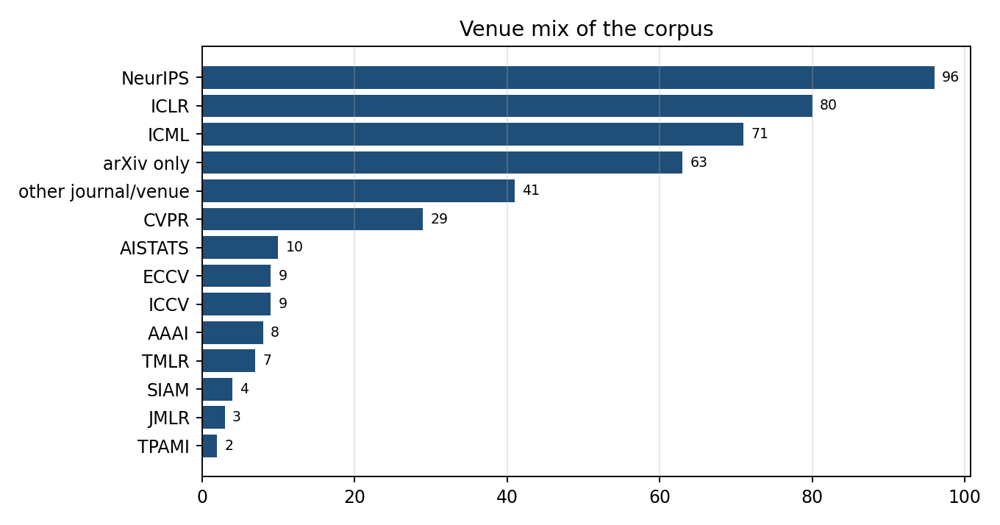

## 5. 最新工作：2025–2026 前沿地图（含 Q3 增量）

### 5.1 理论收口线

| 工作 | 出处·分级 | 一句话 |
|---|---|---|
| IMF 指数收敛率 | NeurIPS 2025 [P] | SB 求解迭代的首个非渐近 KL 指数率 |
| 「reflow≠OT」反例 | Hertrich et al. NeurIPS 2025 [P] | 非最优不动点存在、损失趋零≠最优 |
| **c-RF 计算统计保证** | 2608.02487 [R] | 高斯情形 reflow→OT iff 协方差可交换；c-RF 恒收敛 + 指数率 + minimax 最优 OT 估计 |
| **reflow×minibatch-OT 极限点** | 2608.07042 [R]（Q3 新） | 极限 = N-循环单调耦合；梯度场条件下到 OT 映射 |
| FM almost minimax | Fukumizu ICLR 2025 [P] | 统计上 FM 与扩散等价；$\sigma_t\asymp\sqrt t$ 最优 |
| O(d/T) / O(k/T) | Li–Yan JMLR 2025；MOR 2026 [P] | 线性维数依赖，自适应内在维数 |
| SGM = Wasserstein proximal | SIMODS 2026 [P] | MFG（FP+HJB）刻画 score 模型 |
| Sinkhorn bridge 统计 | 2510.22560 [R] | matching 系估计量统一泛化分析 |
| Entropy-Controlled FM | 2602.22265 [R] | 熵率预算约束 FM = 带显式熵乘子的 SB；Γ-收敛到 OT |
| **PRISM / SDDBMs / 混合分布桥** | 2608.06893 / 2608.08594 / 2608.13383 [R]（Q3 新） | SB 的参考过程设计、端点松弛、高斯混合桥的 Wasserstein 连续性界 |
| **拉格朗日视角 FM** | 2609.00198 [R]（Q3 新） | 去噪器雅可比是轨迹曲率主因 |
| 条件 W 距离几何 | JMLR 2025 [P]（T18） | joint $W_2$ 不控制 posterior $W_2$ |

### 5.2 一步生成新范式线

MeanFlow（NeurIPS 2025 Oral，ImageNet-256 1-NFE FID 3.43）→ W-Flow（Sinkhorn-WGF 蒸馏，1-NFE FID 1.29，[R]）→ **Beckmann Transport Models**（2608.01692，自治速度场精确映射两分布，统一回收 Poisson Flow 与 Equilibrium Matching）→ PMOT（2608.05666，标量势参数化广义 BB）；Flow Map Matching / Transition Matching 把学习对象从瞬时速度改为两时间流映射；LBM（ICCV 2025 Highlight，`reports/2503.07535.md`）把桥蒸馏到 1 NFE；CAF/HRF 放弃常速假设。Q3：MeanFlow 进 SE(3) 抓取与李群约束（2608.03295、2608.26076），平均速度范式成为默认少步方案。

### 5.3 耦合工程线（训练侧）

大规模 Sinkhorn 耦合（2506.05526，Apple：n≈10⁶ 才见真收益）→ 半离散耦合（`reports/2509.25519.md`：全数据集预计算对偶势，训练时查表配对）→ LOOM-CFM（跨 batch 交换局部最优配对）→ C²OT（条件生成中无条件 OT 耦合有害）→ 期望 batch plan 理论（2605.12174）→ Designing OT Flows（让恒等耦合本身最优）→ **Q3：QC-FM 单侧分位数耦合 O(n)**（2608.00978）、**Gromov-Monge FM 等变耦合**（2608.26961）。趋势：从「算更大的 OT」到「算更巧的结构化近似」。

### 5.4 推理期对齐线（免训练侧，T12 七环节）

① 数据管线噪声指派（Immiscible）→ ② 初值检索/搜索（NoiseQuery `reports/2412.05101.md`；verifier×搜索 `reports/2501.09732.md`）→ ③ 初值连续变换（Golden Noise `reports/2411.09502.md`；NoiseRefine）→ ④ OT 桥接 prior（半离散一步桥 + 短程扩散）→ ⑤ 轨迹中段对齐（几乎空白）→ ⑥ 跨帧噪声传输（∫-noise；Go-with-the-Flow）→ ⑦ inversion 侧耦合。**深读发现**：这条线的论文普遍报告质量/对齐指标，**不报告噪声人口边缘的漂移与多样性损失**（T12 深读 §6 一致指出）；Oracle Noise（2604.23540）指出欧氏梯度噪声优化会推离高斯 typical set。§8.2 的 MPNA 正对着这个空位。

### 5.5 桥与翻译线

UniDB++（TPAMI 2026，SOC 统一桥的闭式逆向解 + SDE-Corrector）；DBIM / CDBM（桥的 DDIM / 一致性蒸馏）；FSBM（<8% 配对样本半监督 SB）；CSBM / 3MSBM / Reflected SBM（离散、多边缘动量、有界域）；DIOTM / OTP / ENOT（静态 map 线的稳定化）；LSB（预训练 SD 免训练近似 SB）；Bridge vs FM 统一比较（FM 是 DB 的退化特例）。**Q3 新增 11 篇**（`trends/`）：乳腺 DCE-MRI 潜在桥、MRI 超分桥 10 步、DoseBridge 质子剂量预测（直接以剂量为目标）、EditBridge 4K、ReBridge-Flow 后验桥重耦合、Di²CycleSB、离散扩散桥 DDB（ECCV 2026）、BIT 文本–图像双向桥、UniCycleFlow。T14 深读的经验规律：**随机桥 vs 确定性直线的最优噪声强度由任务条件熵与步数预算决定**（I2SB Table 6/9、DDBM Sec. 5、DBIM Table 4/5、LBM 消融一致）。

### 5.6 系统与评测线

FlashSinkhorn（ICML 2026 Oral，[A]：Sinkhorn = attention 归一化，前向 9–32×、端到端 161×；v0.3.3 后无 release，多 GPU / 非欧 cost 空位仍在）；低秩/层次线 FRLC → HiRef → HALO；端侧 SnapGen / SVDQuant；评测：FID 对少步模型失真；SynthRAD2025 官方证实图像相似度与剂量准确性只有中等相关。Q3：蒸馏被写成 Sinkhorn 散度目标（2608.15215）、FGW 作结构评测（2608.28733）——OT 系评测的外围开始被填充。

### 5.7 顶会趋势

FM 提及级接收量连续两年约 3×（ICLR 7→46→144；ICML 13→56→167；NeurIPS 6→32→88）；OT 平稳上行（ICML 2026 翻倍 43→114）。日程：ECCV 2026 9/8–12（论文集 LNCS 17001–17083 已上线）；NeurIPS 2026 放榜 9/24；ICML 2026 PMLR 卷未出。窗口期判断不变：理论空位约 12–18 个月，应用垂直更长，但 #7 医学桥的窗口在收窄（DoseBridge 已以剂量为目标）。

