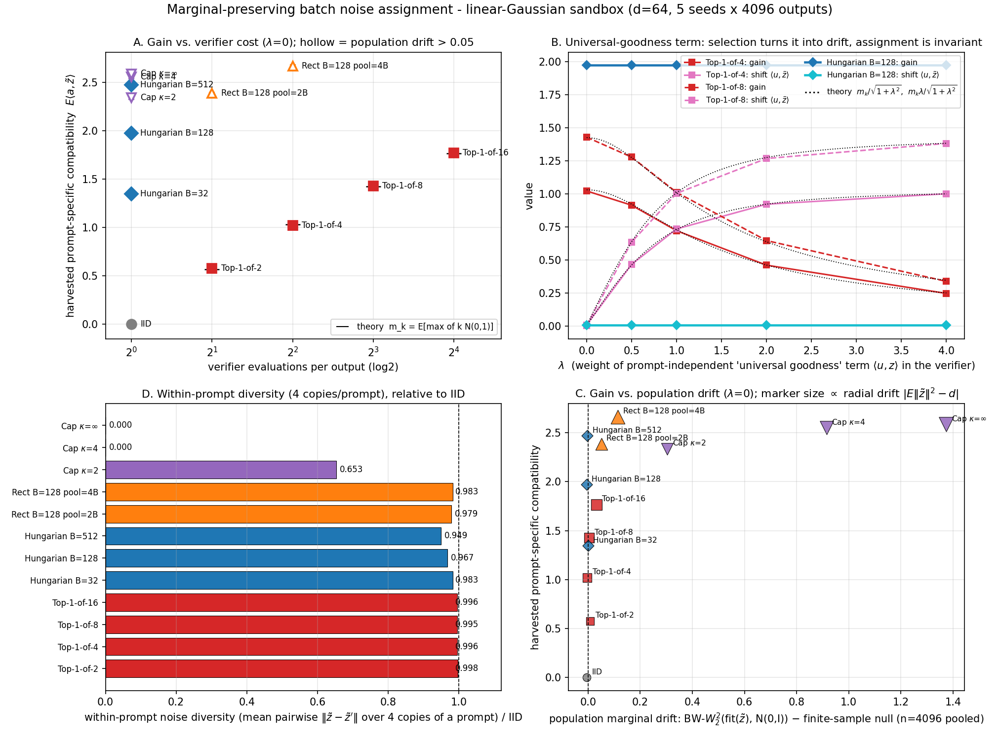

## 8. 我们可以做什么：机会地图、Top-10 状态与一个已立项的样例

### 8.1 Top-10 切入点（2026-09-01 状态）

| # | 切入点 | 类型 | 算力 | 9/1 状态（相对 8/25） | 证据 |
|---|---|---|---|---|---|
| 1 | 免训练 batch 级保边缘噪声指派（MPNA）：batch 内 (条件,噪声) 一次性 Hungarian/Sinkhorn 指派，每噪声恰用一次、人口边缘严格不变 | 方法+理论 | 低 | **已立项，沙盒完成**（§8.2）；最近邻增多（QC-FM 训练侧） | `~/Code/mpna`；2608.00978 |
| 2 | OT-aware 采样调度：Benamou–Brenier 动能泛函替代 KLUB | 理论+免训练 | 低 | 空位仍在；曲率来源有新刻画（去噪器雅可比） | 2609.00198 |
| 3 | 保 OT 耦合的单步桥蒸馏 + 耦合漂移度量 | 方法 | 中 | 空位仍在，**深读证实文献零保证** | `reports/2309.16948.md`, `2405.15885.md`, `2410.22637.md` |
| 4 | reflow 正定理 | 理论 | 低 | **进一步被占**：c-RF + 极限点定理；剩 GMM/流形非渐近刻画与大规模投影算子 | 2608.02487, 2608.07042, 2608.13383 |
| 5 | OT-CFM 端到端统计收敛率 | 理论 | 低 | 空位仍在；函数空间 FM 离散化一致性是可借路线 | 2608.04531 |
| 6 | PF-ODE 次优度量化 | 理论 | 低 | 空位仍在（工具已齐：高斯精确解 + tensor-train FP） | `reports/2405.14250.md` |
| 7 | 解剖商空间成本 + 3D 耦合 SB 刷 SynthRAD2025 + conformal 幻觉筛查 | 应用 | 中 | **窗口收窄**：DoseBridge 已以剂量为目标（非 SB）；须在 MICCAI 2027 周期内动手 | 2608.10173 |
| 8 | FGW 语义对应闭环进扩散采样 | 方法 | 中 | 空位仍在；GW 松弛在图生成侧已用 | 2608.26961 |
| 9 | 视频：时空分解 reflow / 帧间 Sinkhorn 耦合 | 方法 | 中高 | 空位仍在；OT 一致性模块进视频 VAE（ECCV 2026） | 2608.02990 |
| 10 | OT 系评测指标：DINOv2 特征 Sinkhorn divergence 替代 FID | 评测 | 低 | 外围开始填充（蒸馏的 Sinkhorn 目标、FGW 结构评测） | 2608.15215, 2608.28733 |

组合建议不变：#1+#2 构成「推理期耦合工程」连击；#3+#7 构成「医学桥」主线；#5/#6 是纯理论线；#4 转为实用化。

### 8.2 样例：MPNA 立项与沙盒结果（Top-10 #1）

**问题。** 条件生成的初始噪声默认逐样本 iid。「噪声不是生而平等」工作线（Golden Noise、NoiseQuery、verifier×搜索、NoiseRefine）证明选噪声能提升质量，但所有实例级选择都在改有效初始分布：对每个提示从 k 个候选里挑最好，得到的噪声人口分布 $q_k\ne\mathcal N(0,I)$，后果是人口级分布偏移、跨提示同质化、verifier hacking。深读确认这条线的论文不报告边缘漂移。

**形式化。** 把噪声指派写成 Kantorovich 问题：$\max_\pi\mathbb E_\pi[s(c,z)]$ s.t. $\pi\in\Pi(\mu,\nu)$（噪声边缘严格等于 $\nu$）。top-1-of-k 的 $\pi_k\notin\Pi(\mu,\nu)$；batch 置换指派是经验 Kantorovich（Hungarian，O(B³)，B=512 毫秒级）。

**三条理论结果。** Lemma 1（精确保边缘）：任意数据依赖的置换不改变噪声多重集，人口统计量与 iid 同分布。Prop. 2（g–h 分解）：验证器 $s=f(c)+g(z)+h(c,z)$ 中，置换指派对提示无关的「通用好噪声」分量 $g$ 完全不变、只收获交互项 $h$；top-1-of-k 同时收获 $g$ 与 $h$，其漂移正来自 $g$；线性玩具下 top-1-of-k 的增益 $m_k/\sqrt{1+\lambda^2}$、漂移 $m_k\lambda/\sqrt{1+\lambda^2}$ 有闭式。Prop. 3（人口极限）：B→∞ 时经验指派收敛到半离散 OT，提示条件下的噪声分布是 Laguerre 胞腔，重复提示天然保留多样性；共享库检索把胞腔退化为单点。

**沙盒（2026-09-01，d=64，5 seeds × 4096 输出）。**

| 方法（λ=0） | 评分/输出 | 有效增益 | 人口漂移 BW-$W_2^2$ − null | 范数漂移 | 同提示多样性/iid |
|---|---|---|---|---|---|
| IID | 1 | −0.001 | 0 | −0.04 | 1.000 |
| Top-1-of-4 | 4 | 1.021 | −0.003 | +0.41 | 0.996 |
| Top-1-of-16 | 16 | 1.768 | +0.033 | +2.42 | 0.996 |
| **Hungarian B=128** | **1** | **1.972** | **0（逐位=IID）** | **−0.04（=IID）** | 0.967 |
| **Hungarian B=512** | **1** | **2.472** | **0** | **+0.02（=IID）** | 0.949 |
| 共享库检索（κ=∞） | 1 | 2.586 | +1.375 | +5.54 | **0.000** |

全部数字与闭式理论在 MC 误差内吻合（如 k=4 时 λ=0/0.5/1/2/4 的增益 1.021/0.913/0.720/0.459/0.246 vs 理论 1.029/0.921/0.728/0.460/0.250）。Hungarian B=128 以 1 次评分/输出取得等效 top-1-of-25 的增益，人口边缘逐位等于 IID；共享库检索的同提示多样性归零。

**实用方法。** NoiseQuery 式评分器：B 个噪声各做 1 次无条件单步预测 $\hat x_0(z)$（可离线缓存），CLIP 图像编码 vs 提示文本编码得 B×B 相似度矩阵，Hungarian 得置换；开销 +1 NFE + 1 次 CLIP 编码/输出，与 k 无关。

**Claim-driven 实验计划（≤2 主张、5 核心块、3 基线族、3 seeds）。** C1：GenEval / T2I-CompBench 上 Hungarian(B=128) 提升对齐指标且人口边缘与 iid 统计不可区分；同等增益的 top-1-of-k 产生可测漂移。C2：增益来自验证器的提示特异分量，通用分量（美学分）是漂移源——λ 消融。核心块：B1 SDXL-Turbo pilot → B2 top-1-of-k / NoiseQuery 基线 → B3 漂移套件（范数直方图、BW-$W_2^2$、DINOv2 多样性、FID/KID/P-R、同提示 LPIPS）→ B4 λ 消融 → B5 缩放与松弛（B、κ、Sinkhorn ε）。预注册判据：Hungarian GenEval ≥ iid + 1.5 pt 且 ≥ top-1-of-4 增益的 60%，漂移套件两样本检验 p > 0.1。完整立项书：`~/Code/mpna/PROPOSAL.md`。

### 8.3 全景空位地图（按类型）

**理论补全型**：PF-ODE 次优度地形图；流形数据下 encoder map 的法向坍缩/切向 OT 定性；学习误差下的 IMF/α-IMF 收敛；偏差→曲率→NFE 的端到端传导界；top-1-of-k 的次序统计漂移上界（MPNA Prop. 2 已给线性情形）；免训练 vs 蒸馏的信息论下界；reward 微调 = 熵正则 OT 的 σ→0 极限；平均速度/flow map 的误差传播界；CFG 分布偏移的 $W_2$ 刻画；weak/UOT 半对偶的 duality-gap 证书。

**方法/接口缝合型**：一步 OT map 粗对齐 + 冻结扩散 2–4 步细化；半离散 JKO/UOT 势作免训练 guidance；Monge–Ampère 桥规模化；LOOM 与半离散之间的在线全局耦合；端点可解码性 × Sinkhorn barycentric 解码；语义成本系统消融（CLIP/DINO/GW）；离散/多模态耦合成本；免 reflow 的 Burgers 残差正则；多域翻译的可学习 barycenter 中继；**Q3 新增**：QC-FM 与 Hungarian/半离散指派的统一 Pareto（训练侧与推理侧的耦合降本互为镜像）。

**应用垂直型**：医学桥主线（3D 体积一致 SB 刷 SynthRAD2025，以剂量学为目标）；统一 med-bridge benchmark（四层指标）；视频时空分解 reflow；黎曼 rectified flow；WFR 生灭率作推理期模式再平衡；跨维 Gromov-Schrödinger 桥。

**系统/评测型**：分布式 IO-aware Sinkhorn（ring-attention 式分片归约 + 通信下界）；非欧 cost 的 online-LSE 流式化；OT 配对开销统一 benchmark；新一代 neural OT map 精度 benchmark；直线度作端侧可部署性代理。

### 8.4 十二周行动计划（起点 2026-08-25，本周 W2）

- **W1–2**：装备（Peyré 讲义、BB 精读、BW 沙盒、torchcfm + POT/OTT-JAX）✅；MPNA 立项与沙盒 ✅；本知识库上线 ✅。
- **W3–4**：MPNA B1 pilot（SDXL-Turbo + GenEval，3 seeds）→ 继续/转向；复现三件套（Immiscible、OT-CFM、AYS）；NeurIPS 2026 放榜（9/24）后重跑趋势扫描。
- **W5–8**：MPNA B2–B4；#2 理论线（动能泛函调度，以雅可比诱导曲率为变量）；#3 的漂移度量原型（借 T14 深读的四篇桥模型做对照）。
- **W9–12**：MPNA B5 + 投稿骨架（ICLR 2027）；#7 医学线按 MICCAI 2027 布局数据合规。
- **持续触发点**：NeurIPS 2026 放榜（9/24）；ICML 2026 PMLR 卷（FlashSinkhorn [A]→[P]）；FlashSinkhorn ≥v0.4 或多 GPU；SynthRAD post-challenge 榜。
